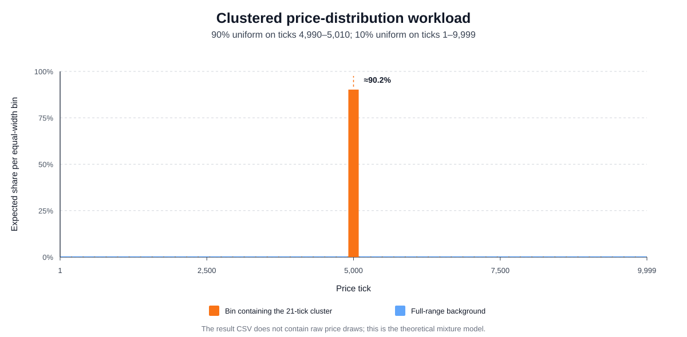
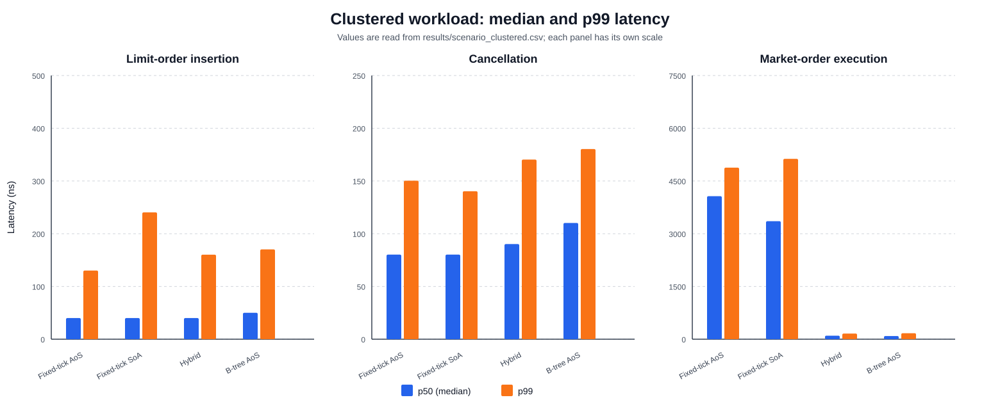
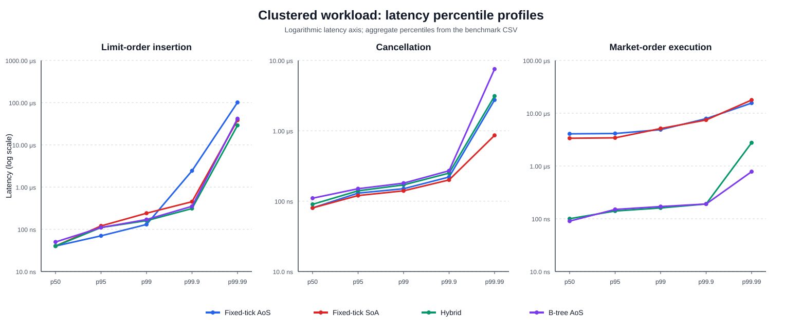

# Clustered Price-Distribution Workload

This scenario uses the global timing and sampling procedure defined in [Experimental Methodology](01_methodology.md).

## 6.2 Clustered distribution around the reference price

### 6.2.1 Definition and purpose

The clustered scenario concentrates most order activity near a fixed reference price of 5,000 ticks while retaining a small full-range component. Let

```math
C=\{4990,4991,\ldots,5010\},
\qquad
F=\{1,2,\ldots,9999\}.
```

The generator first chooses one of two components. With probability 0.90, it samples uniformly from the 21-tick set $C$. With probability 0.10, it samples uniformly from the complete valid set $F$. The probability mass function is therefore

```math
\Pr(P=p)=\frac{0.90}{21}+\frac{0.10}{9999}, \quad p\in C,
\qquad
\Pr(P=p)=\frac{0.10}{9999}, \quad p\notin C.
```

The full-range component can also produce a price inside the cluster. Consequently, the total probability of observing a price between 4,990 and 5,010 is slightly greater than 90%:

```math
\Pr(P\in C)=0.90+0.10\frac{21}{9999}\approx0.90021.
```

Both component distributions are symmetric around tick 5,000, so the expected generated price is also 5,000. Unlike the uniform scenario, this workload repeatedly accesses a small set of price levels and creates substantial depth at those levels. It is designed to exercise temporal and spatial locality, deep per-level queues, and the hybrid implementation's hot zone. The cluster lies entirely inside the hybrid hot-zone interval $[4900,5100)$.

Figure 6.4 shows the theoretical mixture aggregated into 51 equal-width price bins. Aggregation makes the full-range background visible while preserving the dominant central concentration. It is not an empirical histogram because generated prices are not stored in the result CSV.



*Figure 6.4: The clustered workload as a 90% narrow component around tick 5,000 plus a 10% full-range uniform component. The central bin contains the complete 21-tick cluster.*

### 6.2.2 Scenario procedure

The clustered scenario uses the same global timing method and three benchmark phases described in Section 5. For insertion and cancellation, each independent book receives 10,000 orders. Prices follow the clustered mixture, sides alternate between bid and ask, and every quantity is 100 units. Each insertion is measured, after which the order identifiers are shuffled and all cancellations are measured. The book is then replaced. One hundred batches produce 1,000,000 insertion and 1,000,000 cancellation observations for each implementation.

The 90% cluster branch produces approximately 9,000 orders in the 21 central ticks per full book. After the alternating side assignment, this corresponds to approximately 214 resting orders per side at each clustered price level at peak book depth. The random cancellation phase therefore exercises searches and removals in substantially deeper price-level queues than the uniform scenario.

For market-order execution, each new book is pre-populated with 200 asks generated from the same mixture. Approximately 180 of these asks are expected to come from the central component and approximately 20 from the full-range component. The benchmark measures 100 market buys of 100 units before resetting the book. Repeating this process 10,000 times produces 1,000,000 market-order observations per implementation.

This scenario increases the likelihood of cache reuse, but the benchmark does not directly record cache events. Cache-locality explanations therefore remain interpretations of the known access paths and observed latencies rather than direct measurements of cache hits or misses.

### 6.2.3 Results

Table 6.2 reports the median and p99 results from `results/scenario_clustered.csv`. The calibrated TSC frequency for this run was 4.192 GHz.

| Operation | Metric | Fixed-tick AoS | Fixed-tick SoA | Hybrid | B-tree AoS |
|---|---:|---:|---:|---:|---:|
| Insertion | p50 | 168 (40.1 ns) | 168 (40.1 ns) | 168 (40.1 ns) | 210 (50.1 ns) |
|  | p99 | 546 (130.2 ns) | 1,008 (240.5 ns) | 672 (160.3 ns) | 714 (170.3 ns) |
| Cancellation | p50 | 336 (80.2 ns) | 336 (80.2 ns) | 378 (90.2 ns) | 462 (110.2 ns) |
|  | p99 | 630 (150.3 ns) | 588 (140.3 ns) | 714 (170.3 ns) | 756 (180.3 ns) |
| Market order | p50 | 17,052 (4,067.8 ns) | 14,070 (3,356.4 ns) | 420 (100.2 ns) | 378 (90.2 ns) |
|  | p99 | 20,454 (4,879.3 ns) | 21,504 (5,129.8 ns) | 672 (160.3 ns) | 714 (170.3 ns) |

*Table 6.2: Clustered-workload latency in TSC ticks, with derived nanoseconds in parentheses; 1,000,000 observations per implementation and operation.*



*Figure 6.5: Median and p99 operation latency under the clustered price distribution. Each operation uses a separate vertical scale.*

Fixed-tick AoS, fixed-tick SoA, and hybrid all record an insertion median of 168 ticks, while the tree median is 210 ticks. The tree is therefore 25% slower at the median. This result is consistent with direct array access for the fixed-grid implementations, use of the hybrid hot path for central prices, and repeated traversal of a small set of tree nodes in the B-tree implementation. The fixed-tick AoS implementation has the lowest insertion p99 at 546 ticks. SoA has the highest insertion p99 at 1,008 ticks, indicating that its multiple parallel-vector updates are more costly in the upper tail of this workload.

Cancellation produces a different result because clustering creates deep queues. Fixed-tick AoS and SoA tie at a median of 336 ticks, but SoA achieves the lowest p99 at 588 ticks, 6.7% below the fixed-tick AoS p99 of 630 ticks. This is consistent with the SoA cancellation search reading its compact identifier array rather than complete 24-byte order structures. After locating an identifier, however, SoA must remove the corresponding elements from all parallel arrays, which helps explain why its median does not improve over AoS. Hybrid records a median of 378 ticks, while the tree is slowest at 462 ticks because a cancellation combines the order-index lookup, tree-level lookup, and local queue removal.

Market-order execution separates the implementations most strongly. The B-tree has the lowest median at 378 ticks, 10% below the hybrid median of 420 ticks. Hybrid has the lowest p99 at 672 ticks, 5.9% below the tree p99 of 714 ticks. By contrast, fixed-tick AoS and SoA record medians of 17,052 and 14,070 ticks. Their market-buy implementations begin scanning the ask array at tick zero on every call. Once the relatively few low-priced background orders have been consumed, the next available asks are concentrated near tick 5,000, so approximately half of the 10,000-level array must be examined before a fill is found. Tree and hybrid avoid this full-range scan by using ordered tree keys and hot/cold best-price selection.

Relative to the B-tree median, fixed-tick AoS is 45.11 times slower and SoA is 37.22 times slower for market orders. At p99, fixed-tick AoS is 30.44 times slower than hybrid, while SoA is exactly 32.00 times slower. The result shows that improved locality at occupied levels cannot compensate for an algorithm that repeatedly traverses thousands of empty levels.



*Figure 6.6: Latency percentile profiles for the clustered scenario. The vertical axis is logarithmic and each operation is displayed separately.*

Overall, clustered prices benefit the insertion hot paths of the array and hybrid designs, but they also create deep price-level queues and move the active ask region far from the beginning of the fixed arrays. SoA's compact identifier storage becomes visible in p99 cancellation latency, whereas tree and hybrid indexing dominate market-order execution. The clustered scenario therefore reinforces the main data-oriented design principle of this study: an effective layout must be matched to the fields and traversal pattern used by each operation.

## Reproducing the clustered results and figures

Regenerate the CSV and then the three SVG figures from the repository root:

```bash
cargo run --release -- scenario_clustered
python3 scripts/generate_thesis_plots.py --scenario clustered
```

The CSV contains aggregate percentiles rather than raw latency observations, so it cannot produce a latency histogram, violin plot, or empirical cumulative-distribution function.
