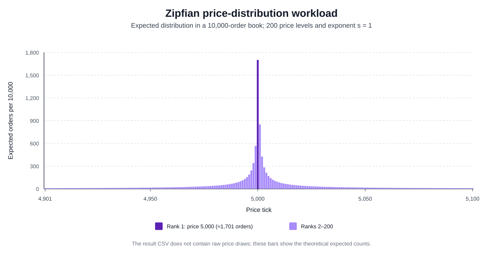
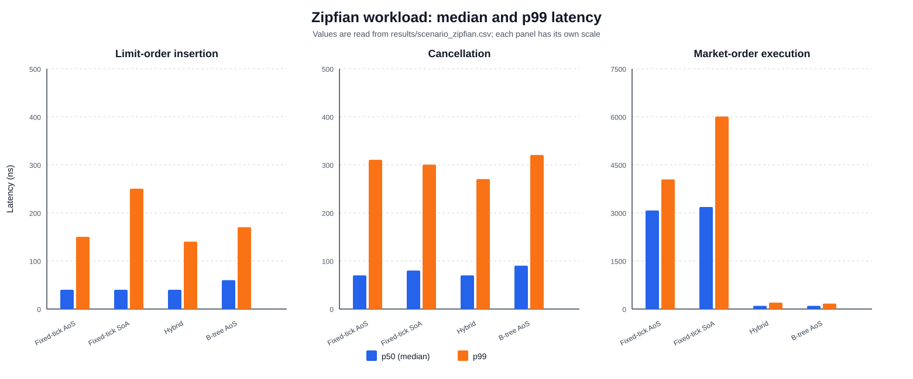
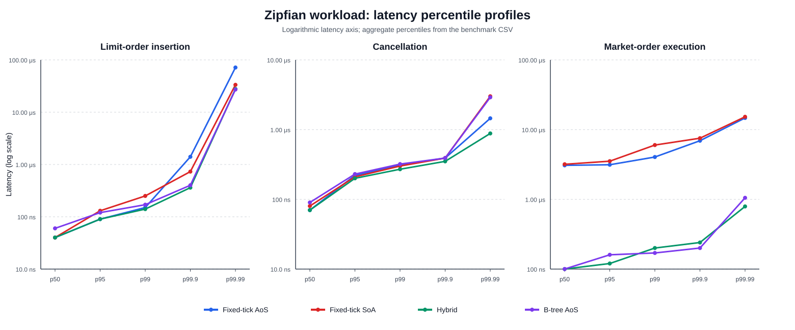

# Zipfian Price-Distribution Workload

This scenario uses the global timing and sampling procedure defined in [Experimental Methodology](01_methodology.md).

## 6.3 Zipfian distribution around the reference price

### 6.3.1 Definition and purpose

The Zipfian scenario assigns a popularity rank to each of 200 distinct price levels. Let $R$ denote the sampled rank. For exponent $s=1$, its probability mass function is

```math
R\in\{1,2,\ldots,200\},
\qquad
\Pr(R=r)=\frac{r^{-1}}{H_{200}},
\qquad
H_{200}=\sum_{k=1}^{200}\frac{1}{k}\approx5.87803.
```

The most popular rank therefore has probability $1/H_{200}\approx17.0125\%$, whereas rank 200 has probability $1/(200H_{200})\approx0.0851\%$. The ten most popular ranks contain approximately 49.83% of the total probability mass. This creates a long-tailed workload in which a small number of levels receive many orders and most levels are visited much less frequently.

Ranks are mapped to prices by alternating above and below a reference price of 5,000 ticks:

```math
R=1 \Rightarrow P=5000,
\qquad
R=2d \Rightarrow P=5000+d,
\qquad
R=2d+1 \Rightarrow P=5000-d.
```

For example, ranks 1, 2, 3, 4, and 5 map to prices 5,000, 5,001, 4,999, 5,002, and 4,998. The complete support extends from tick 4,901 through tick 5,100. Because the hybrid hot zone is the half-open interval $[4900,5100)$, only rank 200, which maps to tick 5,100, lies outside it. The probability that a generated order uses the hot zone is consequently

```math
\Pr(4900\le P<5100)
=1-\frac{1}{200H_{200}}
\approx0.999149.
```

This scenario differs from the clustered mixture in two important ways. It has no full-range background component, and the probabilities within its 200-level support are highly unequal. Rank 1 is expected to receive approximately 1,701 of the 10,000 orders in a full insertion book, while rank 200 is expected to receive only about 8.5. The scenario is a controlled synthetic model of skewed activity and temporal locality, not a calibrated statistical model of a particular market.

Figure 6.7 shows the expected number of orders at every generated price level in a 10,000-order book. Each of the 200 bars represents one price tick from 4,901 through 5,100, and its height is $10000\Pr(P=p)$. The dominant bar at tick 5,000 corresponds to rank 1. Bar heights then decrease with distance from the reference price, with the small alternating difference caused by assigning even ranks above 5,000 and odd ranks below it. The plot is a model of the generator rather than an empirical histogram because the result CSV contains aggregate latency percentiles and does not retain the generated prices.



*Figure 6.7: Theoretical order distribution across the 200 Zipfian price levels. Heights show the expected number of orders at each price in a 10,000-order insertion book.*

### 6.3.2 Scenario procedure

For insertion and cancellation, each independent book receives 10,000 orders sampled from the Zipfian distribution. Sides alternate between bid and ask, and every order has a quantity of 100 units. Each insertion is measured individually. Once the book has been populated, the order identifiers are shuffled and every cancellation is measured. The book is then replaced. One hundred batches produce 1,000,000 insertion and 1,000,000 cancellation observations for each implementation.

The skew creates much deeper queues at popular levels than at rare levels. In expectation, rank 1 receives about 1,701 orders per complete book, or approximately 850 orders per side after alternating side assignment. Rank 2 receives about 851 orders in total, while successively higher ranks receive progressively fewer. Random cancellation therefore combines frequent searches through deep popular queues with less frequent accesses to shallow tail levels.

For market-order execution, each fresh book is pre-populated with 200 Zipfian-distributed asks. The benchmark measures 100 buy market orders of 100 units and then replaces the book. This sequence is repeated 10,000 times to collect 1,000,000 observations per implementation. Approximately 34 of the 200 initial asks are expected at rank 1, while the ten highest-ranked prices collectively account for approximately 100 asks. Because each measured market order consumes one complete ask, the active best price changes during every batch.

The benchmark records operation latency rather than cache or hardware-counter events. References to locality and cache reuse in the analysis are therefore architectural interpretations based on the known distribution and access paths, not direct measurements of cache hits or misses.

### 6.3.3 Results

Table 6.3 reports median and p99 latency from `results/scenario_zipfian.csv`. The calibrated TSC frequency for this run was 4.192 GHz.

| Operation | Metric | Fixed-tick AoS | Fixed-tick SoA | Hybrid | B-tree AoS |
|---|---:|---:|---:|---:|---:|
| Insertion | p50 | 168 (40.1 ns) | 168 (40.1 ns) | 168 (40.1 ns) | 252 (60.1 ns) |
|  | p99 | 630 (150.3 ns) | 1,050 (250.5 ns) | 588 (140.3 ns) | 714 (170.3 ns) |
| Cancellation | p50 | 294 (70.1 ns) | 336 (80.2 ns) | 294 (70.1 ns) | 378 (90.2 ns) |
|  | p99 | 1,302 (310.6 ns) | 1,260 (300.6 ns) | 1,134 (270.5 ns) | 1,344 (320.6 ns) |
| Market order | p50 | 12,894 (3,075.9 ns) | 13,356 (3,186.2 ns) | 420 (100.2 ns) | 420 (100.2 ns) |
|  | p99 | 16,968 (4,047.8 ns) | 25,200 (6,011.6 ns) | 840 (200.4 ns) | 714 (170.3 ns) |

*Table 6.3: Zipfian-workload latency in TSC ticks, with derived nanoseconds in parentheses; 1,000,000 observations per implementation and operation.*



*Figure 6.8: Median and p99 operation latency under the Zipfian price distribution. Each operation uses a separate vertical scale.*

Fixed-tick AoS, fixed-tick SoA, and hybrid all record an insertion median of 168 ticks. The B-tree median is 252 ticks and is therefore 50% higher. The result is consistent with direct array access in the fixed-grid implementations, use of the hybrid array for almost every generated price, and repeated reuse of a small set of popular levels. Hybrid records the lowest insertion p99 at 588 ticks. Fixed-tick AoS is 7.1% higher at 630 ticks, the tree is 21.4% higher at 714 ticks, and SoA is 78.6% higher at 1,050 ticks.

Hybrid and fixed-tick AoS tie for the lowest median cancellation latency at 294 ticks. Hybrid also has the lowest cancellation p99 at 1,134 ticks, followed by SoA at 1,260 ticks, fixed-tick AoS at 1,302 ticks, and the tree at 1,344 ticks. The deep queues at popular ranks make local identifier searches more important than in the uniform scenario. SoA's compact identifier vector is consistent with its p99 being lower than the fixed-tick AoS result, but updating all parallel arrays after an identifier is found prevents it from obtaining the lowest median. Hybrid combines the same order layout as AoS with direct access for 99.915% of generated prices.

Market-order execution again produces the largest separation. Hybrid and B-tree both record a median of 420 ticks. Fixed-tick AoS requires 12,894 ticks and SoA requires 13,356 ticks, making them 30.70 and 31.80 times slower than the two best median results. At p99, the B-tree is best at 714 ticks, followed by hybrid at 840 ticks. Fixed-tick AoS is 23.76 times slower than the tree at p99, and SoA is 35.29 times slower.

The structural cause is best-price discovery. Zipfian asks are concentrated around tick 5,000. The fixed-grid market-buy paths begin searching at the low end of their ask arrays and traverse thousands of empty entries before reaching the active region on every call. The tree obtains the smallest occupied key without a full-range scan, while hybrid compares candidates from its hot and cold representations. Concentrating nearly all activity in the hybrid array is advantageous, although the B-tree records the lower market-order p99 in this run.

Figure 6.9 extends the comparison through p99.99. The maximum is omitted because a single interruption or scheduling event can dominate it; the high percentiles give a more stable description of the observed tail.



*Figure 6.9: Latency percentile profiles for the Zipfian scenario. The vertical axis is logarithmic and each operation is displayed separately.*

Overall, the Zipfian workload rewards implementations that combine locality at popular levels with efficient ordered access. The fixed-grid and hybrid representations provide the best median insertion results, hybrid performs best for cancellation in both reported percentiles, and tree and hybrid dominate market-order execution. The scenario also shows that high locality at occupied levels does not compensate for scanning a large empty price range to discover the next executable order.

## Reproducing the Zipfian results and figures

Regenerate the CSV and then the three SVG figures from the repository root:

```bash
cargo run --release -- scenario_zipfian
python3 scripts/generate_thesis_plots.py --scenario zipfian
```

The CSV contains aggregate percentiles rather than raw latency observations, so it cannot produce a latency histogram, violin plot, or empirical cumulative-distribution function.
