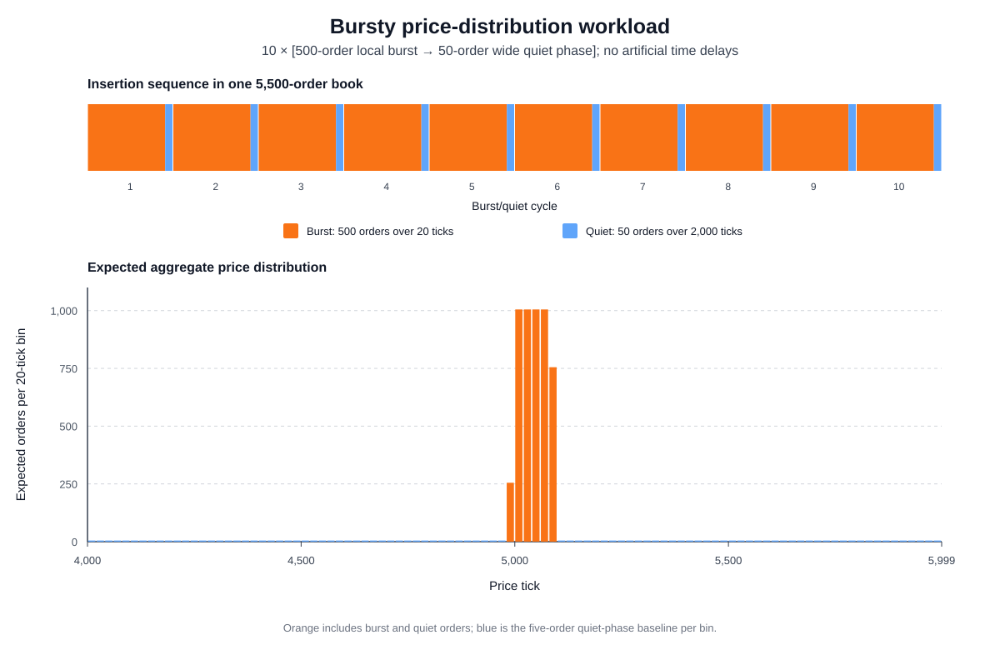
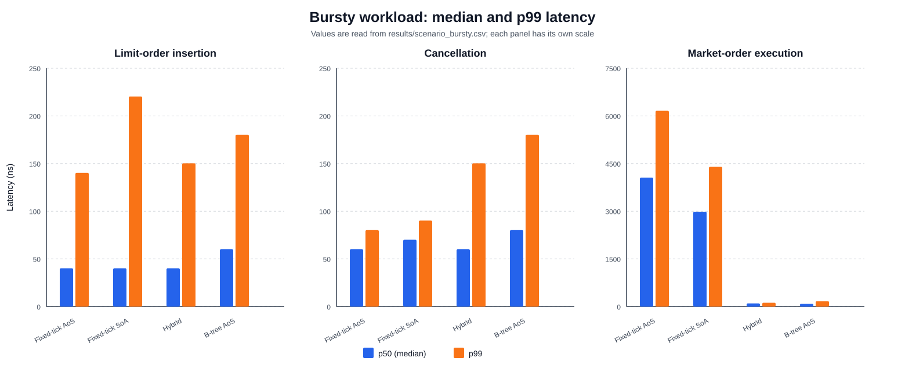
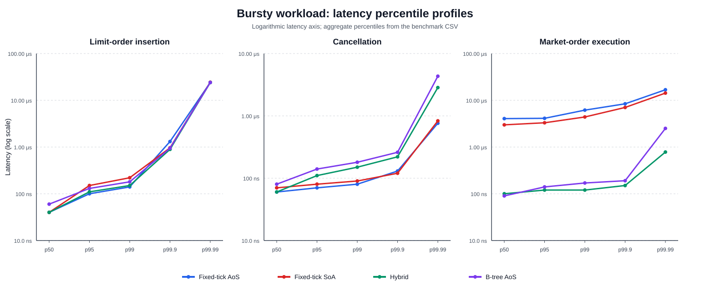

# Bursty Price-Distribution Workload

This scenario uses the global timing and sampling procedure defined in [Experimental Methodology](01_methodology.md).

## 6.4 Bursty distribution with changing locality

### 6.4.1 Definition and purpose

The bursty scenario alternates long, tightly concentrated insertion phases with short, widely distributed phases. It is an access-pattern model: operations are executed consecutively without artificial sleeps, network delays, or a simulated wall-clock arrival rate. The terms *burst* and *quiet* describe the number and price locality of consecutive orders, not elapsed time between them.

One complete insertion book contains ten burst/quiet cycles. For cycle $j\in\{0,1,\ldots,9\}$, the burst-price set is

```math
C_j=\{4990+10j,4991+10j,\ldots,5009+10j\}.
```

The benchmark inserts 500 orders sampled uniformly from the 20 ticks in $C_j$. It then inserts 50 quiet-phase orders sampled uniformly from

```math
W=\{4000,4001,\ldots,5999\}.
```

The sequence for a complete book is therefore

```math
B_0,Q_0,B_1,Q_1,\ldots,B_9,Q_9,
```

where every $B_j$ contains 500 orders and every $Q_j$ contains 50 orders. A complete book contains 5,500 orders: 5,000 burst orders and 500 quiet orders. Thus, $10/11\approx90.91\%$ of insertions belong to a tightly concentrated burst and $1/11\approx9.09\%$ belong to a wide quiet phase. The burst center moves from tick 5,000 in the first cycle to tick 5,090 in the final cycle.

The aggregate distribution can be expressed using $n(p)$, the number of burst sets $C_j$ containing price $p$:

```math
\Pr(P=p)=\frac{n(p)}{220}+\frac{1}{22000},
\qquad p\in W.
```

The first term is the combined burst contribution and the second is the quiet-phase background. A price included in one burst window receives 25 expected burst orders per complete book; a price included in two overlapping windows receives 50. Every tick in $W$ additionally receives 0.25 expected quiet orders.

All burst prices lie inside the hybrid hot zone $[4900,5100)$. The quiet distribution places 200 of its 2,000 possible prices in that interval. Consequently, the expected hot-zone share of a complete insertion book is

```math
\Pr(4900\le P<5100)
=\frac{10}{11}+\frac{1}{11}\frac{200}{2000}
=\frac{101}{110}
\approx0.91818.
```

Figure 6.10 preserves both defining properties of the scenario. The upper panel shows the temporal order of the ten insertion cycles, with segment widths proportional to operation counts. The lower panel aggregates those cycles into 20-tick price bins, exposing the wide quiet-phase baseline and the concentrated, gradually shifting burst region. These are theoretical expected counts, not a histogram of recorded prices, because the result CSV retains latency summaries rather than individual generated prices.



*Figure 6.10: The bursty insertion workload. Ten 500-order local bursts alternate with 50-order wide quiet phases; the lower panel shows their expected aggregate price distribution in a complete 5,500-order book.*

### 6.4.2 Scenario procedure

For insertion, a new book follows the ten-cycle pattern described above. Prices within each phase are sampled uniformly, sides alternate between bid and ask across the complete sequence, and every quantity is 100 units. Every insertion is timed individually. Full 5,500-order books are repeated until 1,000,000 observations have been collected; the final book contains the remaining partial pattern.

After a book has been populated, all of its order identifiers are shuffled and the same orders are cancelled in random order. Every cancellation is measured. Cancellation therefore retains the aggregate price-level depths created by the bursty generator but does not preserve the temporal burst/quiet sequence. This distinction prevents insertion-phase transition effects from being attributed directly to the cancellation results.

The market-order phase uses a third pattern. Each fresh book is pre-populated with 200 asks uniformly distributed over ticks 4,990 through 5,009. The benchmark measures 100 buy market orders of 100 units and then replaces the book. Repeating this process 10,000 times produces 1,000,000 market-order observations per implementation. The market phase represents execution against a tightly concentrated burst book; it does not alternate with the 2,000-tick quiet distribution and its center does not drift.

Accordingly, this scenario is not an end-to-end simulation of market events arriving at a changing rate. It isolates three related workloads: temporally alternating insertion locality, randomized cancellation from the resulting book, and market execution against a narrow price cluster. The benchmark does not record cache, branch-prediction, allocation, or hardware-counter events, so explanations involving those mechanisms remain architectural interpretations.

### 6.4.3 Results

Table 6.4 reports median and p99 latency from `results/scenario_bursty.csv`. The calibrated TSC frequency for this run was 4.192 GHz.

| Operation | Metric | Fixed-tick AoS | Fixed-tick SoA | Hybrid | B-tree AoS |
|---|---:|---:|---:|---:|---:|
| Insertion | p50 | 168 (40.1 ns) | 168 (40.1 ns) | 168 (40.1 ns) | 252 (60.1 ns) |
|  | p99 | 588 (140.3 ns) | 924 (220.4 ns) | 630 (150.3 ns) | 756 (180.3 ns) |
| Cancellation | p50 | 252 (60.1 ns) | 294 (70.1 ns) | 252 (60.1 ns) | 336 (80.2 ns) |
|  | p99 | 336 (80.2 ns) | 378 (90.2 ns) | 630 (150.3 ns) | 756 (180.3 ns) |
| Market order | p50 | 17,010 (4,057.8 ns) | 12,516 (2,985.8 ns) | 420 (100.2 ns) | 378 (90.2 ns) |
|  | p99 | 25,830 (6,161.9 ns) | 18,438 (4,398.5 ns) | 504 (120.2 ns) | 714 (170.3 ns) |

*Table 6.4: Bursty-workload latency in TSC ticks, with derived nanoseconds in parentheses; 1,000,000 observations per implementation and operation.*



*Figure 6.11: Median and p99 operation latency under the bursty workload. Each operation uses a separate vertical scale.*

Fixed-tick AoS, fixed-tick SoA, and hybrid all record an insertion median of 168 ticks. Because 90.91% of insertions occur in narrow burst phases, the median primarily characterizes the high-locality path. The B-tree median is 252 ticks and is 50% higher. Fixed-tick AoS has the lowest insertion p99 at 588 ticks. Hybrid is 7.1% higher at 630 ticks, the tree is 28.6% higher at 756 ticks, and SoA is 57.1% higher at 924 ticks. The p99 includes the wide quiet phase, so it reflects both phase types rather than only the concentrated bursts.

Fixed-tick AoS and hybrid tie for the lowest cancellation median at 252 ticks. Fixed-tick AoS has the lowest cancellation p99 at 336 ticks, followed by SoA at 378 ticks. Hybrid reaches 630 ticks and the tree reaches 756 ticks. Approximately 8.18% of generated prices lie outside the hybrid hot zone and use its cold tree representation. Because cancellations are randomly ordered, these cold accesses are dispersed throughout the cancellation sequence and contribute to the upper tail. The direct-indexed fixed-tick implementation does not change its lookup structure when the price leaves the central range.

Market-order execution again separates best-price discovery from price-level access. The B-tree records the lowest median at 378 ticks, followed by hybrid at 420 ticks. Fixed-tick AoS and SoA require 17,010 and 12,516 ticks, making them 45.00 and 33.11 times slower than the tree median. The fixed arrays begin their ask search near the lowest supported tick and scan almost 5,000 empty entries before reaching asks concentrated around tick 5,000. SoA's compact arrays reduce the scan cost relative to fixed-tick AoS but do not eliminate it.

At p99, hybrid is best at 504 ticks and the tree follows at 714 ticks. Fixed-tick AoS is 51.25 times slower than hybrid, while SoA is 36.58 times slower. All market-phase prices fall inside the hybrid array, allowing it to combine concentrated storage with hot/cold best-price selection. The B-tree avoids the long fixed-grid scan but retains tree traversal and level-management costs.

Figure 6.12 shows the complete recorded percentile profiles through p99.99. Because the CSV contains only aggregate percentiles, it cannot establish whether transition points produce a bimodal latency distribution; demonstrating bimodality would require retaining phase labels or raw observations. Maximum values are omitted because isolated operating-system interruptions can dominate a single maximum.



*Figure 6.12: Latency percentile profiles for the bursty scenario. The vertical axis is logarithmic and each operation is displayed separately.*

Overall, the bursty workload favors direct or hot-zone indexing for the high-locality insertion majority, while fixed-tick AoS provides the strongest p99 result when wide quiet-phase insertions are included. Its advantage does not extend to market execution: tree and hybrid avoid scanning the empty lower half of the price range and are substantially faster. The results also demonstrate why the temporal scope of each phase must remain explicit—only insertion directly measures transitions between burst and quiet locality.

## Reproducing the bursty results and figures

Regenerate the CSV and then the three SVG figures from the repository root:

```bash
cargo run --release -- scenario_bursty
python3 scripts/generate_thesis_plots.py --scenario bursty
```

The CSV contains aggregate percentiles rather than raw latency observations, so it cannot produce a latency histogram, violin plot, empirical cumulative-distribution function, or phase-labelled latency comparison.
