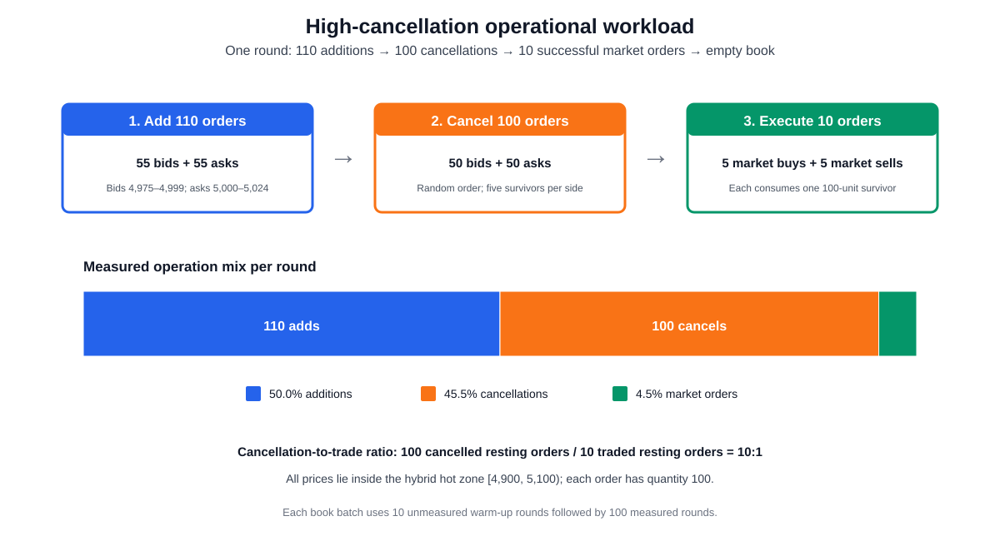
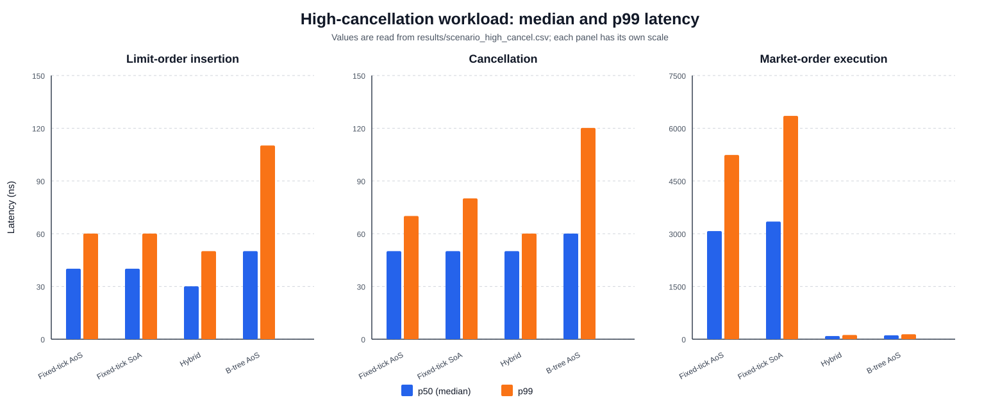
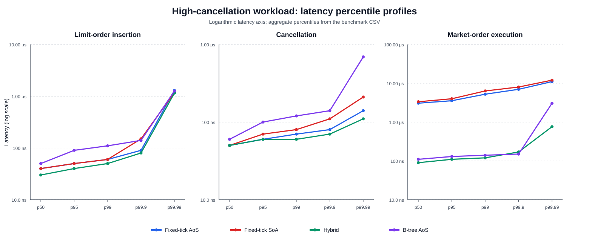

# High-Cancellation-Ratio Operational Workload

This scenario uses the global timing procedure defined in [Experimental Methodology](01_methodology.md). Unlike the price-distribution scenarios in Section 6, the operational scenarios control the sequence and relative frequency of different order-book operations.

## 7.1 High-cancellation workload

### 7.1.1 Definition and purpose

The high-cancellation scenario represents a quote-heavy workload in which most resting orders are withdrawn before execution. Each round begins with an empty book and performs the following sequence:

```math
110\ \mathrm{additions}
\longrightarrow
100\ \mathrm{cancellations}
\longrightarrow
10\ \mathrm{market\ orders}
\longrightarrow
\mathrm{empty\ book}.
```

The insertion phase adds 55 bids and 55 asks. Bid prices are sampled uniformly from

```math
B=\{4975,4976,\ldots,4999\},
```

while ask prices are sampled uniformly from

```math
A=\{5000,5001,\ldots,5024\}.
```

Every order has a quantity of 100 units. The two sides are interleaved during insertion. Fifty identifiers are then selected randomly from each side and all 100 selected orders are cancelled in shuffled order. Exactly five bids and five asks remain. Five market buys consume the surviving asks and five market sells consume the surviving bids, so all ten market orders succeed and the round finishes with an empty book.

Because each market order consumes exactly one resting order, the cancellation-to-trade ratio is

```math
\frac{100\ \mathrm{cancelled\ resting\ orders}}
{10\ \mathrm{traded\ resting\ orders}}
=10:1.
```

The complete round contains 220 measured operations: additions account for 50.0%, cancellations for approximately 45.5%, and market orders for approximately 4.5%. The 10:1 ratio therefore compares cancellations with traded resting orders; it does not mean that ten out of every eleven measured method calls are cancellations.

This pattern approximates the behavior of participants who place and frequently revise quotes while only a minority of their resting orders execute. It is nevertheless a controlled synthetic workload rather than a calibrated model of a specific exchange. The benchmark is single-threaded and does not simulate message-arrival times, network processing, concurrent access, lock contention, or throughput.

All generated prices lie inside the hybrid implementation's hot-zone interval $[4900,5100)$. The scenario therefore measures the intended hybrid hot path and does not evaluate transitions into its cold B-tree representation. With 55 orders uniformly distributed across 25 levels on each side, the expected initial depth is only 2.2 orders per side/price level. The scenario stresses the frequency of successful cancellations rather than cancellation from very deep individual queues.

Figure 7.1 summarizes the round and its measured operation mix.



*Figure 7.1: One high-cancellation round. Of 110 inserted orders, 100 are cancelled and the remaining ten are consumed by successful market orders, producing a 10:1 cancellation-to-trade ratio.*

### 7.1.2 Scenario procedure

The benchmark creates 100 independent book batches for each implementation. A batch uses a deterministic pseudo-random stream derived from seed 42 and the batch index. It first executes ten unmeasured warm-up rounds and then 100 measured rounds. Because every round returns the logical book to an empty state, book depth does not accumulate between rounds. Reusing the same book within a batch allows internal vector and hash-table allocations established during warm-up to be reused during measurement.

Each insertion, cancellation, and market-order method call is timed individually with the global TSC procedure. Order construction, identifier collection, random selection, and shuffling occur outside the measured intervals. Market-order return values and fill correctness are checked after the end timestamp. The public best-bid and best-ask checks are performed only after a complete batch, preventing their potentially long fixed-array scans from warming the measured path between rounds.

Across the 100 batches, the benchmark records 10,000 measured rounds per implementation. This produces:

- 1,100,000 insertion measurements;
- 1,000,000 successful cancellation measurements; and
- 100,000 successful market-order measurements.

The differing sample counts follow directly from the 110:100:10 operation counts in each round. Comparisons between implementations use identical generated events and equal sample counts for a given operation, but sample counts should not be compared across different operations as though they were equal.

### 7.1.3 Results

Table 7.1 reports median and p99 latency from the regenerated `results/scenario_high_cancel.csv`. The calibrated TSC frequency for this run was 4.192 GHz.

| Operation | Metric | Fixed-tick AoS | Fixed-tick SoA | Hybrid | B-tree AoS |
|---|---:|---:|---:|---:|---:|
| Insertion | p50 | 168 (40.1 ns) | 168 (40.1 ns) | 126 (30.1 ns) | 210 (50.1 ns) |
|  | p99 | 252 (60.1 ns) | 252 (60.1 ns) | 210 (50.1 ns) | 462 (110.2 ns) |
| Cancellation | p50 | 210 (50.1 ns) | 210 (50.1 ns) | 210 (50.1 ns) | 252 (60.1 ns) |
|  | p99 | 294 (70.1 ns) | 336 (80.1 ns) | 252 (60.1 ns) | 504 (120.2 ns) |
| Market order | p50 | 12,894 (3,075.8 ns) | 14,028 (3,346.3 ns) | 378 (90.2 ns) | 462 (110.2 ns) |
|  | p99 | 21,966 (5,239.8 ns) | 26,628 (6,351.9 ns) | 504 (120.2 ns) | 588 (140.3 ns) |

*Table 7.1: High-cancellation-workload latency in TSC ticks, with derived nanoseconds in parentheses. Each implementation contributes 1,100,000 insertion, 1,000,000 cancellation, and 100,000 market-order observations.*



*Figure 7.2: Median and p99 latency in the high-cancellation scenario. Each operation uses a separate vertical scale.*

Hybrid records the lowest insertion latency at both reported percentiles: 126 ticks at the median and 210 ticks at p99. Fixed-tick AoS and SoA both record 168 ticks at the median and 252 ticks at p99, making them 33.3% and 20.0% slower than hybrid at the respective percentiles. The B-tree result is 210 ticks at the median and 462 ticks at p99. The concentration of every price in the 200-level hot array favors the hybrid design, while the B-tree retains an ordered-map lookup for every insertion.

Cancellation is the principal operation of interest in this workload. Fixed-tick AoS, SoA, and hybrid tie at a median of 210 ticks. Hybrid separates from the other implementations in the tail, recording the lowest p99 at 252 ticks. Fixed-tick AoS is 16.7% higher at 294 ticks, SoA is 33.3% higher at 336 ticks, and the B-tree is twice as high at 504 ticks. The shallow expected per-level depth limits the benefit of scanning a compact SoA identifier vector. For the B-tree, cancellation still combines the order-index lookup with a tree lookup and local vector removal.

Market-order execution produces the largest difference. Hybrid records the lowest median at 378 ticks, followed by the B-tree at 462 ticks. Fixed-tick AoS and SoA require 12,894 and 14,028 ticks, making them 34.11 and 37.11 times slower than hybrid. At p99, hybrid records 504 ticks and the B-tree records 588 ticks, whereas fixed-tick AoS and SoA require 21,966 and 26,628 ticks—43.58 and 52.83 times the hybrid result.

The principal structural explanation is best-price discovery. Asks occupy ticks 5,000 through 5,024 and bids occupy ticks 4,975 through 4,999. The fixed-grid implementations begin their searches at an extreme of the complete 10,000-level price array and therefore inspect thousands of empty entries on every market order. The B-tree accesses its lowest ask or highest bid through ordered keys. Hybrid limits array traversal to its 200-level hot region and compares it with an empty cold tree. Consequently, direct indexing helps the fixed-grid mutation paths but becomes a liability when an operation requires ordered discovery across a mostly empty global grid.

Figure 7.3 extends the comparison through p99.99. The maximum is omitted because a single interrupt or scheduling event can dominate it. The high percentiles remain within-run observations and do not replace repeated-run confidence intervals.



*Figure 7.3: Latency percentile profiles for the high-cancellation workload. The vertical axis is logarithmic and each operation is displayed separately.*

Overall, hybrid performs best in this operational scenario: it has the lowest insertion median and p99, ties for the lowest cancellation median, records the lowest cancellation p99, and provides the lowest market-order latency. This result must be interpreted together with the workload design. All prices are intentionally restricted to the hybrid hot zone, so the experiment evaluates cancellation-heavy traffic under favorable locality rather than the hybrid structure's behavior across its hot/cold boundary.

## Reproducing the high-cancellation results and figures

Regenerate the CSV and then the three SVG figures from the repository root:

```bash
cargo run --release -- scenario_high_cancel
python3 scripts/generate_thesis_plots.py --scenario high_cancel
```

The CSV contains aggregate percentiles rather than raw observations, so it cannot produce latency histograms, violin plots, empirical cumulative-distribution functions, or phase-labelled comparisons.
