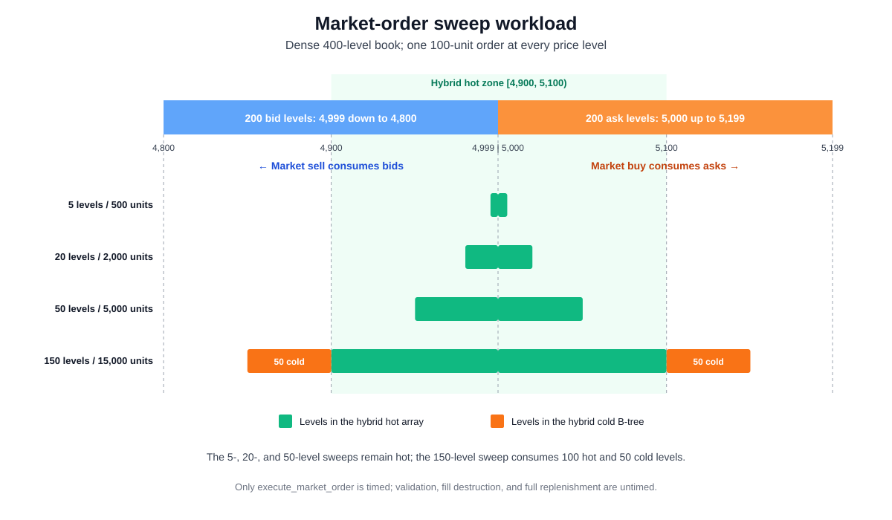
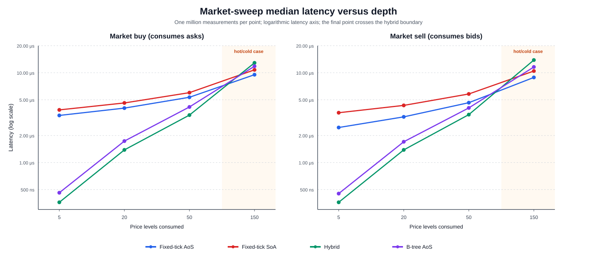
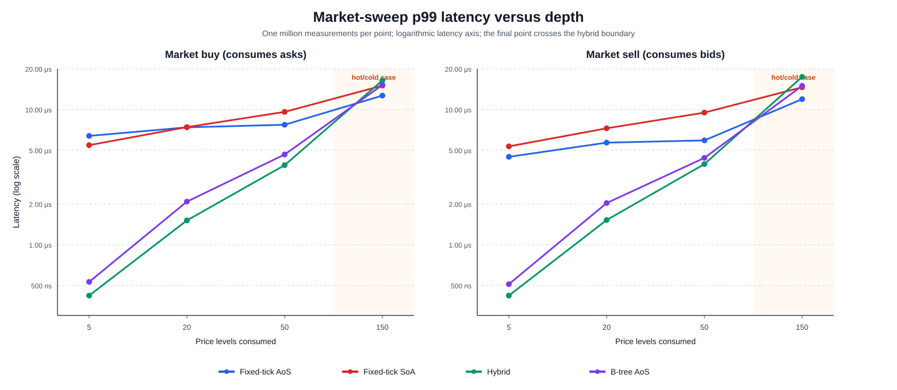

# Multi-Level Market-Order Sweep Workload

This scenario uses the global TSC timing procedure defined in [Experimental Methodology](01_methodology.md), with the sweep-specific measurement boundary described below.

## 7.2 Market-order sweeps

### 7.2.1 Definition and purpose

A market-order sweep is an aggressive order whose quantity is larger than the liquidity available at the best price. The matching engine must consume the best level, continue to the next price, and repeat until the complete requested quantity has been filled. This scenario evaluates how execution latency scales with the number of consecutive price levels visited in one `execute_market_order` call.

Each book contains 200 consecutive bid levels and 200 consecutive ask levels:

```math
B=\{4800,4801,\ldots,4999\},
\qquad
A=\{5000,5001,\ldots,5199\}.
```

There is one resting order of 100 units at every level. The book therefore has a one-tick spread and 20,000 units of resting liquidity on each side. Four sweep depths are measured:

```math
L\in\{5,20,50,150\},
\qquad
Q_L=100L.
```

A market buy consumes the lowest $L$ ask levels, while a market sell consumes the highest $L$ bid levels. The corresponding quantities are 500, 2,000, 5,000, and 15,000 units. Because each resting order has the same quantity as one 100-unit slice of the incoming order, every consumed level produces one complete fill and partial resting-order fills are avoided.

The hybrid hot zone is $[4900,5100)$. Starting from the spread, the first 100 executable levels in either direction belong to the hot array. The 5-, 20-, and 50-level cases remain entirely inside that array. The 150-level case consumes 100 hot levels and then 50 levels from the hybrid cold B-tree. It therefore tests both sweep scaling and the cost of crossing the representation boundary.

Figure 7.4 illustrates the initial book and the price range consumed by each case.



*Figure 7.4: Dense sweep-book construction. Short and medium sweeps remain in the hybrid hot array; the 150-level sweep continues through 50 cold-tree levels on either side.*

This scenario is a controlled execution benchmark rather than a complete model of a market shock. It does not simulate stop-order cascades, strategic responses, price impact on subsequent order flow, network arrival times, or a flash crash.

### 7.2.2 Scenario procedure

Each implementation is tested separately for all four depths and both directions. A new benchmark book is populated with all 400 resting orders. Ten unmeasured warm-up sweep pairs are performed before measurement. The order of the buy and sell calls alternates on every round so one direction is not systematically measured first.

After each sweep, the benchmark verifies the number, price, quantity, and maker identifier of every fill. It also verifies price priority and restores all consumed levels before the next measurement. Replenishment gives every timed call the same dense book shape and makes this a warm, steady-state benchmark rather than a progressively depleted or cold-cache experiment.

Only the call to `execute_market_order` is inside the timed interval. Matching, order-index updates, removal of resting orders, and creation of the returned fill vector are therefore included. Result unwrapping, correctness validation, destruction of the fill vector, and replenishment occur after the ending timestamp and are excluded. This sweep-specific handling of the returned vector differs from the distribution scenarios, where destruction occurs inside their measured closure.

Each depth/direction combination contains 1,000,000 observations. With four depths and two directions, every implementation contributes 8,000,000 measured sweep calls and the four implementations contribute 32,000,000 calls in total. Measurements are divided into 100 book batches per depth, with at most 10,000 measured rounds in each batch.

### 7.2.3 Results

Table 7.2 reports median and p99 latency from the regenerated `results/scenario_sweep.csv`. The calibrated TSC frequency for this run was 4.192 GHz.

| Sweep | Metric | Fixed-tick AoS | Fixed-tick SoA | Hybrid | B-tree AoS |
|---|---:|---:|---:|---:|---:|
| 5-level buy | p50 | 14,028 (3,346.4 ns) | 16,170 (3,857.4 ns) | 1,512 (360.7 ns) | 1,932 (460.9 ns) |
|  | p99 | 26,754 (6,382.2 ns) | 22,848 (5,450.4 ns) | 1,764 (420.8 ns) | 2,226 (531.0 ns) |
| 5-level sell | p50 | 10,290 (2,454.7 ns) | 15,036 (3,586.9 ns) | 1,512 (360.7 ns) | 1,890 (450.9 ns) |
|  | p99 | 18,732 (4,468.6 ns) | 22,386 (5,340.2 ns) | 1,764 (420.8 ns) | 2,142 (511.0 ns) |
| 20-level buy | p50 | 16,926 (4,037.7 ns) | 19,320 (4,608.8 ns) | 5,796 (1,382.6 ns) | 7,266 (1,733.3 ns) |
|  | p99 | 30,954 (7,384.1 ns) | 31,080 (7,414.2 ns) | 6,342 (1,512.9 ns) | 8,736 (2,084.0 ns) |
| 20-level sell | p50 | 13,524 (3,226.2 ns) | 18,144 (4,328.3 ns) | 5,796 (1,382.6 ns) | 7,140 (1,703.3 ns) |
|  | p99 | 23,856 (5,690.9 ns) | 30,450 (7,263.9 ns) | 6,384 (1,522.9 ns) | 8,526 (2,033.9 ns) |
| 50-level buy | p50 | 22,344 (5,330.2 ns) | 25,158 (6,001.5 ns) | 14,154 (3,376.5 ns) | 17,430 (4,158.0 ns) |
|  | p99 | 32,340 (7,714.8 ns) | 40,278 (9,608.4 ns) | 16,254 (3,877.4 ns) | 19,488 (4,648.9 ns) |
| 50-level sell | p50 | 19,446 (4,638.9 ns) | 24,318 (5,801.1 ns) | 14,322 (3,416.5 ns) | 17,010 (4,057.8 ns) |
|  | p99 | 24,780 (5,911.3 ns) | 39,774 (9,488.2 ns) | 16,548 (3,947.6 ns) | 18,396 (4,388.4 ns) |
| 150-level buy | p50 | 39,858 (9,508.2 ns) | 45,150 (10,770.6 ns) | 54,012 (12,884.7 ns) | 49,518 (11,812.6 ns) |
|  | p99 | 53,130 (12,674.3 ns) | 63,000 (15,028.8 ns) | 68,796 (16,411.4 ns) | 63,714 (15,199.1 ns) |
| 150-level sell | p50 | 37,170 (8,867.0 ns) | 43,806 (10,450.0 ns) | 58,044 (13,846.5 ns) | 48,594 (11,592.2 ns) |
|  | p99 | 50,022 (11,932.9 ns) | 61,278 (14,618.0 ns) | 73,080 (17,433.4 ns) | 62,748 (14,968.7 ns) |

*Table 7.2: Sweep latency in TSC ticks, with derived nanoseconds in parentheses; 1,000,000 observations for each implementation, direction, and sweep depth.*



*Figure 7.5: Median buy- and sell-sweep latency as the number of consumed price levels increases. The vertical axis is logarithmic and the final point crosses the hybrid hot/cold boundary.*

For the 5-level case, hybrid records a median of 360.7 ns in both directions. The B-tree follows at 460.9 ns for buys and 450.9 ns for sells. Fixed-tick AoS requires 3,346.4 ns for buys and 2,454.7 ns for sells, while SoA requires 3,857.4 and 3,586.9 ns. Hybrid is therefore approximately 9.28 times faster than fixed-tick AoS for the small buy sweep and 6.80 times faster for the small sell sweep.

Hybrid remains fastest at 20 and 50 levels. At 20 levels its median is 1,382.6 ns in either direction, compared with approximately 1.7 microseconds for the B-tree. At 50 levels, hybrid records 3,376.5 ns for buys and 3,416.5 ns for sells; the B-tree records 4,158.0 and 4,057.8 ns. The fixed-grid gap narrows as sweep depth increases because its initial best-price scan is amortized across more consecutive occupied levels. Once the first executable level is found, the next levels are adjacent array entries.

The ranking reverses in the 150-level case. Fixed-tick AoS becomes fastest, with medians of 9,508.2 ns for buys and 8,867.0 ns for sells. SoA is second, the B-tree is third, and hybrid is slowest at 12,884.7 and 13,846.5 ns. The hybrid transition is also visible in marginal median cost. Between 20 and 50 levels, each additional level adds approximately 279 TSC ticks for a hybrid buy and 284 ticks for a hybrid sell. Between 50 and 150 levels, which introduces the cold tree, the corresponding differences rise to approximately 399 and 437 ticks per added level. These values are differences between aggregate medians, not percentiles of individually measured per-level costs.

Fixed-tick AoS shows the opposite scaling tendency. Its additional median cost falls to approximately 175 ticks per added buy level and 177 ticks per added sell level between 50 and 150 levels. The large fixed-grid discovery cost is spread across a longer dense traversal, while array indexing remains unchanged at the 100-level hybrid boundary.



*Figure 7.6: p99 buy- and sell-sweep latency across the four sweep depths. The vertical axis and highlighted cross-zone case match Figure 7.5.*

The p99 results preserve the same main pattern. Hybrid is best for 5-, 20-, and 50-level sweeps, with the B-tree second. At 150 levels, fixed-tick AoS has the lowest p99 in both directions: 12,674.3 ns for buys and 11,932.9 ns for sells. Hybrid has the highest cross-zone p99 at 16,411.4 and 17,433.4 ns. The crossover confirms that the optimal representation depends not only on current price locality but also on how far an aggressive order traverses through the book.

SoA does not outperform fixed-tick AoS in the median results. This workload has exactly one complete order at each consumed level, so it does not exploit SoA's compact identifier scanning within a deep queue. Instead, matching must update several parallel vectors for every level. The result should therefore not be generalized to price levels containing many orders.

Overall, hybrid is the strongest design for ordinary sweeps contained within its configured hot region, while fixed-tick AoS becomes strongest for a long, dense sweep that crosses the hybrid boundary. The B-tree provides comparatively consistent scaling without the fixed array's initial sparse scan or the hybrid's representation transition. No implementation is uniformly optimal across sweep depths.

## Reproducing the sweep results and figures

Regenerate the full CSV and the three SVG figures from the repository root:

```bash
cargo run --release -- scenario_sweep
python3 scripts/generate_thesis_plots.py --scenario sweep
```

The default benchmark collects 32 million measured sweep calls and can take several minutes. A smaller development run can be requested without changing the source:

```bash
ORDERBOOK_SWEEP_SAMPLES_PER_DIRECTION=10000 \
  cargo run --release -- scenario_sweep
```

A reduced run overwrites `results/scenario_sweep.csv` and must not be used as the final thesis dataset unless its lower sample count is stated explicitly.
