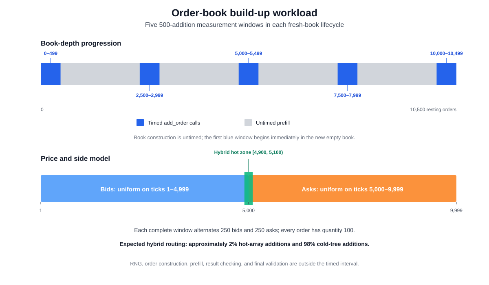
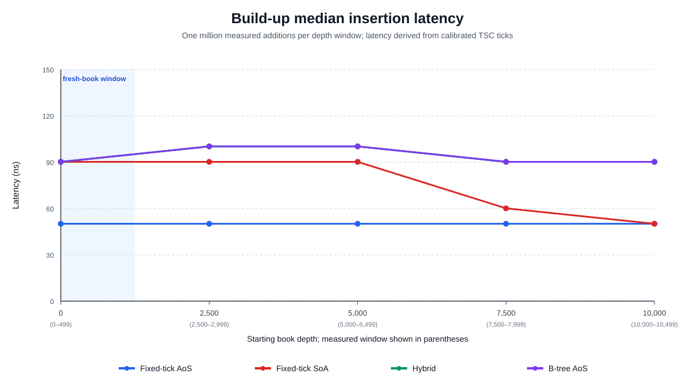
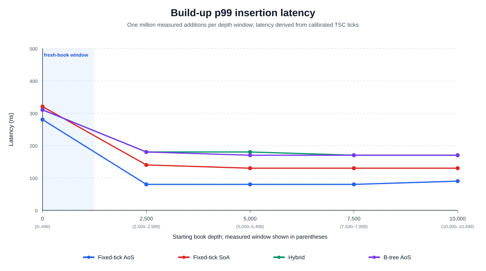

# Order-Book Build-Up Operational Workload

This scenario uses the global TSC timing procedure defined in [Experimental Methodology](01_methodology.md), with the build-up-specific measurement boundary described below.

## 7.3 Order-book build-up

### 7.3.1 Definition and purpose

The build-up scenario evaluates whether limit-order insertion latency changes as the number of resting orders increases. Unlike the distribution scenarios, which repeatedly operate on a previously populated book, this benchmark follows the growth of a logically fresh book. It samples five separate 500-addition windows beginning at 0%, 25%, 50%, 75%, and 100% of a 10,000-order reference depth.

Let $D$ be the number of resting orders at the beginning of a measurement window. The selected starting depths are

```math
D \in \{0,2500,5000,7500,10000\}.
```

At each starting depth, the next 500 calls to `add_order` are measured. The corresponding depth windows are

```math
W_D=\{D,D+1,\ldots,D+499\}.
```

Consequently, the final window starts at the 10,000-order reference depth but ends at 10,499 resting orders. The label “100%” identifies the start of that window; it does not imply that the book stops growing at exactly 10,000 orders.

The order stream is deterministic. Sides alternate, and every complete window contains 250 bids and 250 asks. Bid and ask prices are drawn independently from non-overlapping supports:

```math
P_{bid} \sim \mathrm{DiscreteUniform}(\{1,2,\ldots,4999\}),
```

```math
P_{ask} \sim \mathrm{DiscreteUniform}(\{5000,5001,\ldots,9999\}).
```

This guarantees a non-crossed book throughout the lifecycle. Every order has quantity 100. The wide price support creates many occupied price levels and deliberately provides little locality for the hybrid representation. Its hot array covers $[4900,5100)$, containing 100 possible bid prices and 100 possible ask prices. With the balanced side mix, the expected hot-array share is

```math
\Pr(\text{hot})
=\frac{1}{2}\frac{100}{4999}
+\frac{1}{2}\frac{100}{5000}
\approx 0.020002.
```

Thus, approximately 2.00% of additions use the hybrid hot array and 98.00% use its cold B-tree. Figure 7.7 summarizes both the depth windows and the price model.



*Figure 7.7: One build-up lifecycle. Blue regions contain timed additions, gray regions are untimed prefill, and the lower bar shows the separated bid/ask supports and narrow hybrid hot zone.*

This workload isolates insertion while varying book state; it is not a complete model of an exchange opening auction or a trading session. In particular, it does not model time-varying order arrival rates, cancellations, executions, strategic price placement, or intraday changes in spread and volatility.

### 7.3.2 Scenario procedure

For every implementation, one lifecycle proceeds as follows:

1. Generate a deterministic stream of 10,500 order specifications. Random-number generation occurs before book construction and is not timed.
2. Construct a new empty book. Construction itself is not timed.
3. Measure additions at depths 0 through 499.
4. Prefill without timing until the book contains exactly 2,500 orders, then measure additions at depths 2,500 through 2,999.
5. Repeat the untimed prefill and 500-addition measurement procedure for starting depths 5,000, 7,500, and 10,000.
6. Verify that the final book is non-crossed. The first lifecycle also verifies the complete depth at every price and the best bid and ask.

Only `add_order` is inside the TSC interval. Order construction, random-number generation, result checking, checkpoint prefill, and final validation are excluded. Allocations, hash-table growth, tree-node creation, and other work triggered by a measured addition remain included. Equivalent events triggered during a prefill gap are excluded. The results therefore compare the five sampled windows; they do not measure every addition in one continuous build from zero to 10,500.

Each implementation uses 2,000 fresh logical books. Every lifecycle contributes 500 observations to each of the five windows, producing 1,000,000 measurements per window and 5,000,000 measured calls per implementation. Across all four implementations, the scenario contains 20,000,000 timed `add_order` calls.

“Fresh” refers to the logical state of the order book. The benchmark remains in one process, so the allocator, executable code, operating-system page cache, and other machine state can remain warm across lifecycles. The first window should therefore be interpreted as insertion into a newly constructed data structure, not as a cold reboot of the computer. Hardware cache hits and misses were not counted in this experiment, so cache behavior cannot be identified directly from latency alone.

### 7.3.3 Results

Table 7.3 reports median and p99 insertion latency from the regenerated `results/scenario_buildup.csv`. The calibrated TSC frequency for this run was 4.192 GHz.

| Starting depth and measured window | Metric | Fixed-tick AoS | Fixed-tick SoA | Hybrid | B-tree AoS |
|---|---:|---:|---:|---:|---:|
| 0 (0–499) | p50 | 210 (50.1 ns) | 378 (90.2 ns) | 378 (90.2 ns) | 378 (90.2 ns) |
|  | p99 | 1,176 (280.5 ns) | 1,344 (320.6 ns) | 1,302 (310.6 ns) | 1,302 (310.6 ns) |
| 2,500 (2,500–2,999) | p50 | 210 (50.1 ns) | 378 (90.2 ns) | 420 (100.2 ns) | 420 (100.2 ns) |
|  | p99 | 336 (80.2 ns) | 588 (140.3 ns) | 756 (180.3 ns) | 756 (180.3 ns) |
| 5,000 (5,000–5,499) | p50 | 210 (50.1 ns) | 378 (90.2 ns) | 420 (100.2 ns) | 420 (100.2 ns) |
|  | p99 | 336 (80.2 ns) | 546 (130.2 ns) | 756 (180.3 ns) | 714 (170.3 ns) |
| 7,500 (7,500–7,999) | p50 | 210 (50.1 ns) | 252 (60.1 ns) | 378 (90.2 ns) | 378 (90.2 ns) |
|  | p99 | 336 (80.2 ns) | 546 (130.2 ns) | 714 (170.3 ns) | 714 (170.3 ns) |
| 10,000 (10,000–10,499) | p50 | 210 (50.1 ns) | 210 (50.1 ns) | 378 (90.2 ns) | 378 (90.2 ns) |
|  | p99 | 378 (90.2 ns) | 546 (130.2 ns) | 714 (170.3 ns) | 714 (170.3 ns) |

*Table 7.3: Insertion latency in TSC ticks, with derived nanoseconds in parentheses; 1,000,000 observations for each implementation and depth window.*



*Figure 7.8: Median `add_order` latency across the five sampled depth windows. The shaded region identifies the window beginning in a newly constructed empty book.*

Fixed-tick AoS has the most stable median: 210 TSC ticks, or 50.1 ns, in every window. Its direct price indexing is unchanged as the number of resting orders grows. Although the number of occupied levels increases, insertion already identifies the destination level from the integer price, so it does not search through the existing book depth.

SoA begins at 378 ticks (90.2 ns), remains at that value through the 5,000-order checkpoint, falls to 252 ticks (60.1 ns) at 7,500, and reaches 210 ticks (50.1 ns) in the mature window. Its mature-book median is therefore 44.4% lower than its fresh-window median and matches fixed-tick AoS. This result shows a depth-associated improvement in this workload, but the aggregate percentiles do not reveal which individual allocation or memory-layout event causes the step changes.

Hybrid and B-tree AoS produce almost identical median curves. Both begin at 378 ticks, rise to 420 ticks in the 2,500- and 5,000-order windows, and return to 378 ticks at 7,500 and 10,000. Their mature medians are unchanged from the first window and are 1.8 times the fixed-tick median. The similarity is expected from the workload routing: approximately 98% of hybrid additions use the same kind of cold B-tree organization tested by the tree-only implementation. The small hot share is insufficient to separate their aggregate medians.



*Figure 7.9: p99 `add_order` latency across the same windows. All four implementations have a substantially heavier p99 in the first 500 additions.*

The p99 curves reveal a stronger fresh-book effect than the medians. In the first window, p99 ranges from 1,176 ticks (280.5 ns) for fixed-tick AoS to 1,344 ticks (320.6 ns) for SoA. At the 2,500-order checkpoint it falls to 336 ticks for fixed-tick, 588 for SoA, and 756 for Hybrid and B-tree AoS. Relative to the first window, the final-window p99 is lower by 67.9% for fixed-tick, 59.4% for SoA, and 45.2% for both Hybrid and B-tree AoS.

The benchmark does not record allocator events or hardware counters, so the reason for this first-window tail cannot be proven from the CSV. It is nevertheless consistent with initialization work that occurs on early insertions, such as allocating storage for newly encountered price levels or growing auxiliary indices. Later books are not globally cold, and later windows also exclude allocation events that happen during untimed prefill. The p99 reduction must therefore be described as a property of this measurement procedure rather than attributed solely to increasing depth or improved cache residency.

Overall, insertion latency does not grow monotonically with total resting-order count. Fixed-tick AoS is depth-independent at the median and has the lowest p99 in every sampled window. SoA improves as the book matures, while the mostly cold-path Hybrid follows B-tree AoS closely. The clearest shared result is not a mature-book penalty but a heavier p99 during the first 500 insertions into each newly constructed data structure.

## Reproducing the build-up results and figures

Regenerate the full CSV and the three SVG figures from the repository root:

```bash
cargo run --release -- scenario_buildup
python3 scripts/generate_thesis_plots.py --scenario buildup
```

The default run collects 20 million measured insertion calls. A smaller development run can be requested without changing the source:

```bash
ORDERBOOK_BUILDUP_SAMPLES_PER_POINT=10000 \
  cargo run --release -- scenario_buildup
```

A reduced run overwrites `results/scenario_buildup.csv` and must not be used as the final thesis dataset unless its lower sample count is stated explicitly.
