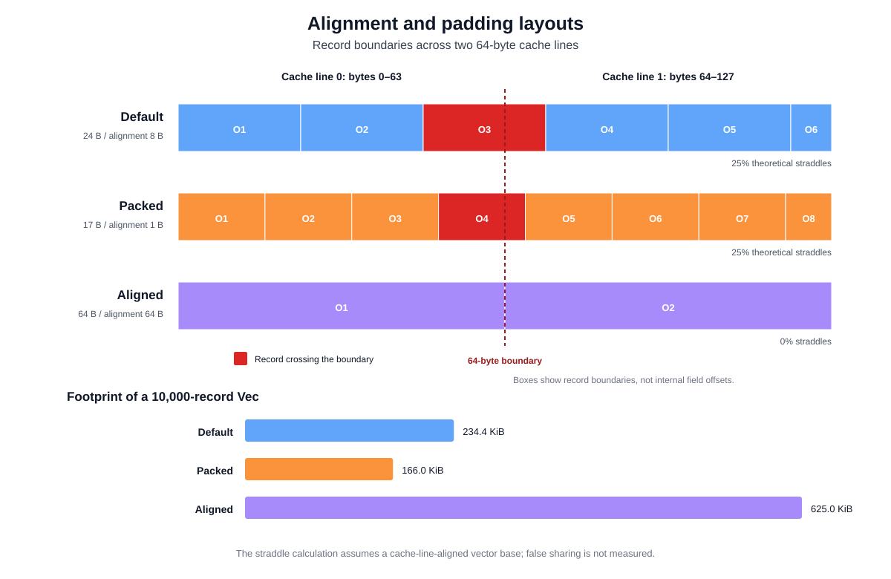
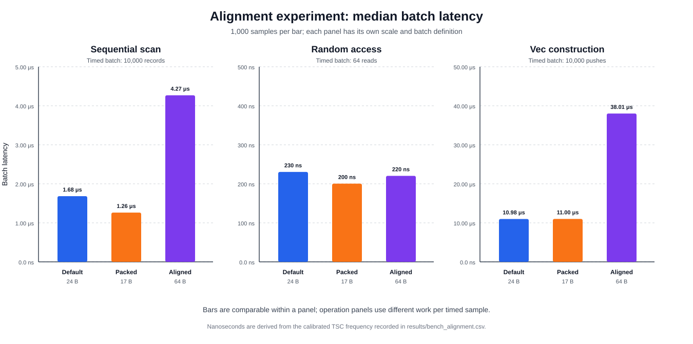
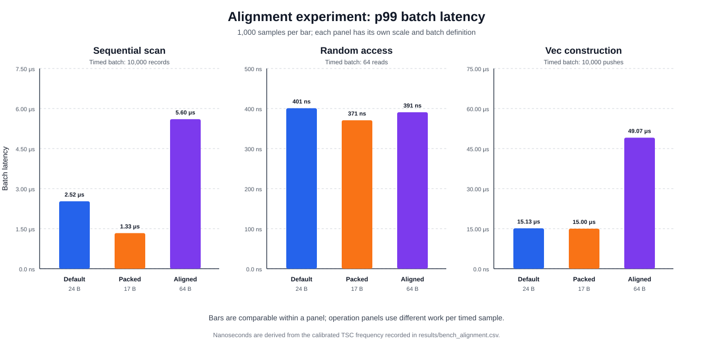

# Alignment and Padding Experiment

This experiment uses the global TSC timing procedure defined in [Experimental Methodology](01_methodology.md). The measurement unit in this chapter is a batch of record operations rather than one complete limit-order-book operation.

## 8.1 Alignment and padding

### 8.1.1 Definition and purpose

The alignment experiment isolates the memory representation of an order-like record from the rest of the matching engine. It asks how reducing padding or forcing every record onto a separate cache line affects sequential reading, random reading, and vector construction.

All three variants contain the same logical fields: a 64-bit identifier, an 8-bit side, a 32-bit price, and a 32-bit quantity. Their compiled representations differ:

| Layout | Rust representation | Size | Alignment | 10,000-record footprint |
|---|---|---:|---:|---:|
| Default | Rust's default representation | 24 B | 8 B | 240,000 B (234.4 KiB) |
| Packed | `repr(packed)` | 17 B | 1 B | 170,000 B (166.0 KiB) |
| Aligned | `repr(C, align(64))` | 64 B | 64 B | 640,000 B (625.0 KiB) |

The Default values are observations from `size_of` and `align_of` for the compiler used in this experiment. Rust does not guarantee the internal field order of a type using its default representation, so the 24-byte layout must not be treated as a stable cross-compiler ABI.

Packed removes all padding and reduces the footprint by 29.2% relative to Default. Its 32-bit quantity can begin at an address that is not divisible by four, so the benchmark uses `addr_of!` and `ptr::read_unaligned` instead of creating a potentially invalid aligned reference. Aligned rounds every record to one complete 64-byte cache line. It uses 2.67 times as much memory as Default, but adjacent records cannot occupy the same cache line.

For a vector base assumed to begin on a cache-line boundary, 25% of both Default and Packed records cross a 64-byte boundary. Aligned records never cross one. Packed still places more useful records in a given byte range despite having the same theoretical straddle proportion. Figure 8.1 shows these record boundaries and the resulting vector footprints.



*Figure 8.1: Record boundaries across two cache lines and the storage required for 10,000 records. Red records cross the 64-byte boundary. Internal field offsets are intentionally omitted because the Default field order is not a stable Rust guarantee.*

Cache-line isolation can prevent false sharing when different threads modify adjacent records. This benchmark is single-threaded and read-dominated, however, so it does not measure false sharing or cache-coherence traffic. Hardware cache hits, cache misses, and memory-bandwidth counters are also not collected. The latency results can show an association with layout size but cannot directly identify the responsible hardware events.

### 8.1.2 Experimental procedure

Three operations are measured separately for each layout:

1. **Sequential scan:** A vector of 10,000 records is constructed before timing. One sample iterates over the complete vector and sums every quantity. The final sum is passed to `black_box`. Each sample therefore contains 10,000 quantity reads.
2. **Random access:** A vector of 500,000 records and all random indices are generated before timing. One sample performs 64 indexed quantity reads, passing every value to `black_box`. The 64 reads share one pair of TSC timestamps to amortize timestamp overhead.
3. **Vector construction:** A prepared 10,000-record source vector is created before timing. One sample creates an empty destination `Vec`, pushes all 10,000 copied records without reserving capacity, passes the completed vector to `black_box`, and drops it. Allocation, capacity growth, copying, and deallocation are therefore included.

The random-access vectors occupy approximately 11.44 MiB for Default, 8.11 MiB for Packed, and 30.52 MiB for Aligned. The layouts consequently expose different memory footprints by design; this is part of the experiment rather than a controlled constant.

Every layout/operation pair contains 1,000 timed samples. Data generation, random-index generation, and source-vector construction occur outside the measurement interval. There is no explicit warm-up stage. Sequential and random inputs are reused across samples, so later observations can operate on machine state influenced by earlier observations. The layouts are also executed in a fixed order—Default, Packed, and Aligned—rather than a randomized order.

The reported values are batch latencies. A sequential-scan sample and a vector-construction sample each represent 10,000 records, whereas a random-access sample represents 64 reads. The three operation panels should not be compared numerically with one another. Comparisons are meaningful between layouts within the same operation.

This is a representation microbenchmark rather than an end-to-end order-book benchmark. It does not include price-level lookup, order matching, identifier indexing, cancellation, or synchronization between threads.

### 8.1.3 Results

Table 8.1 reports median and p99 batch latency from the regenerated `results/bench_alignment.csv`. The calibrated TSC frequency for this run was 4.192 GHz.

| Timed batch | Metric | Default (24 B) | Packed (17 B) | Aligned (64 B) |
|---|---:|---:|---:|---:|
| Sequential scan, 10,000 records | p50 | 7,056 (1,683.2 ns) | 5,292 (1,262.4 ns) | 17,892 (4,268.2 ns) |
|  | p99 | 10,584 (2,524.8 ns) | 5,586 (1,332.6 ns) | 23,478 (5,600.7 ns) |
| Random access, 64 reads | p50 | 966 (230.4 ns) | 840 (200.4 ns) | 924 (220.4 ns) |
|  | p99 | 1,680 (400.8 ns) | 1,554 (370.7 ns) | 1,638 (390.7 ns) |
| Vector construction, 10,000 pushes | p50 | 46,032 (10,981.0 ns) | 46,116 (11,001.1 ns) | 159,348 (38,012.7 ns) |
|  | p99 | 63,420 (15,129.0 ns) | 62,874 (14,998.7 ns) | 205,716 (49,073.9 ns) |

*Table 8.1: Batch latency in TSC ticks, with derived nanoseconds in parentheses; 1,000 observations for each layout and operation.*



*Figure 8.2: Median batch latency for the three record layouts. Each panel has its own scale and workload definition.*

Packed has the lowest sequential-scan median at 1,262.4 ns, 25.0% below Default. Aligned requires 4,268.2 ns, or 2.54 times the Default median. The ordering is consistent with the amount of memory traversed: Packed scans 29.2% fewer bytes than Default, while Aligned scans 2.67 times as many. Because no hardware counters were recorded, the experiment cannot determine how much of the difference comes from cache misses, cache-line transfers, prefetch behavior, or generated load instructions.

For the 64-read random batch, Packed again has the lowest median at 200.4 ns. It is 13.0% below Default. Aligned records 220.4 ns, 4.3% below Default but 10.0% above Packed. Cache-line alignment therefore does not compensate for Packed's smaller footprint in this test, although the differences are much smaller than in the sequential scan. The result applies to this 500,000-record, 64-read batch on the tested processor; it is not evidence that one layout always has lower single-access latency.

Default and Packed are effectively tied during vector construction. Their medians differ by only 84 TSC ticks, or 20.1 ns over the complete 10,000-push batch—a 0.18% difference. Aligned takes 38,012.7 ns, 3.46 times the Default median. This batch writes and reallocates a 625 KiB destination instead of a 234.4 KiB or 166.0 KiB destination, and its timed interval also includes destruction of that destination.



*Figure 8.3: p99 batch latency for sequential scan, random access, and vector construction. Panels retain independent scales because their timed batches contain different work.*

At p99, Packed's sequential scan is 47.2% below Default and its random batch is 7.5% below Default. Default and Packed remain nearly equal for construction, with Packed 0.9% lower. Aligned has p99 construction latency 3.24 times that of Default and p99 scan latency 2.22 times that of Default.

Only 1,000 observations are collected per point, and the experiment does not report confidence intervals or repeat runs. Its p99 corresponds to a small upper subset of those batches and should be interpreted more cautiously than the median. The maximum values are retained in the CSV but are not used to rank the layouts because a single interrupted sample can dominate a maximum.

Overall, reducing the record from 24 to 17 bytes materially improves reading in this experiment without changing vector-construction latency. Expanding each record to 64 bytes is costly for sequential traversal and construction and provides no advantage over Packed for the tested random reads. Cache-line alignment could still be appropriate for a multithreaded write workload where preventing false sharing is the objective, but that benefit is outside the scope of these measurements.

## Reproducing the alignment results and figures

Regenerate the CSV and all three SVG figures from the repository root:

```bash
cargo run --release -- bench_alignment
python3 scripts/generate_thesis_plots.py --scenario alignment
```

A smaller development run can be requested without changing the source:

```bash
ORDERBOOK_ALIGNMENT_SAMPLES=100 \
  cargo run --release -- bench_alignment
```

A reduced run overwrites `results/bench_alignment.csv` and must not be used as the final thesis dataset unless its lower sample count is stated explicitly.
