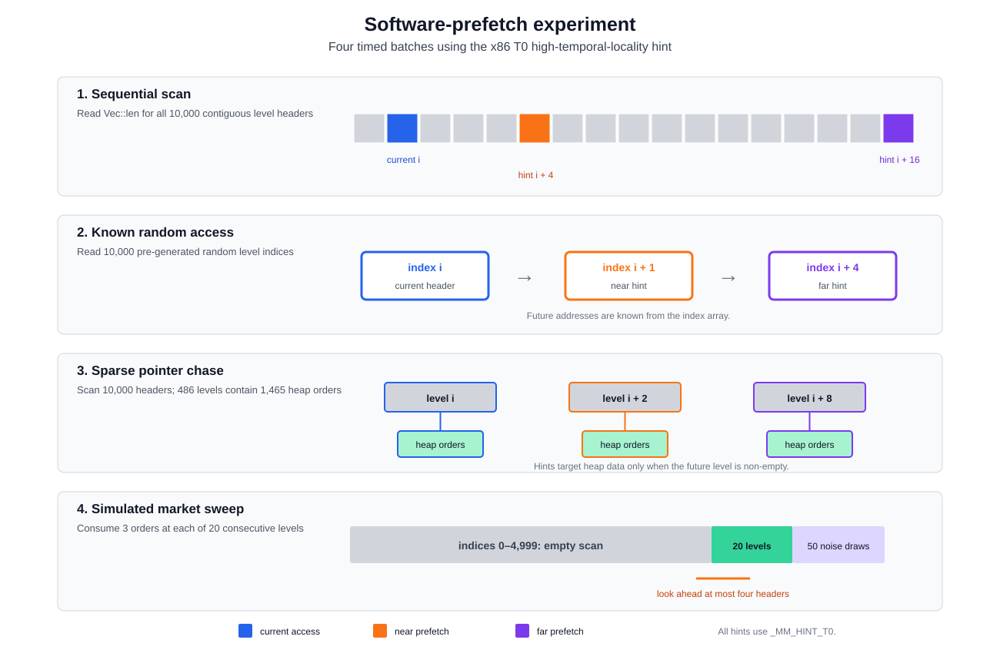
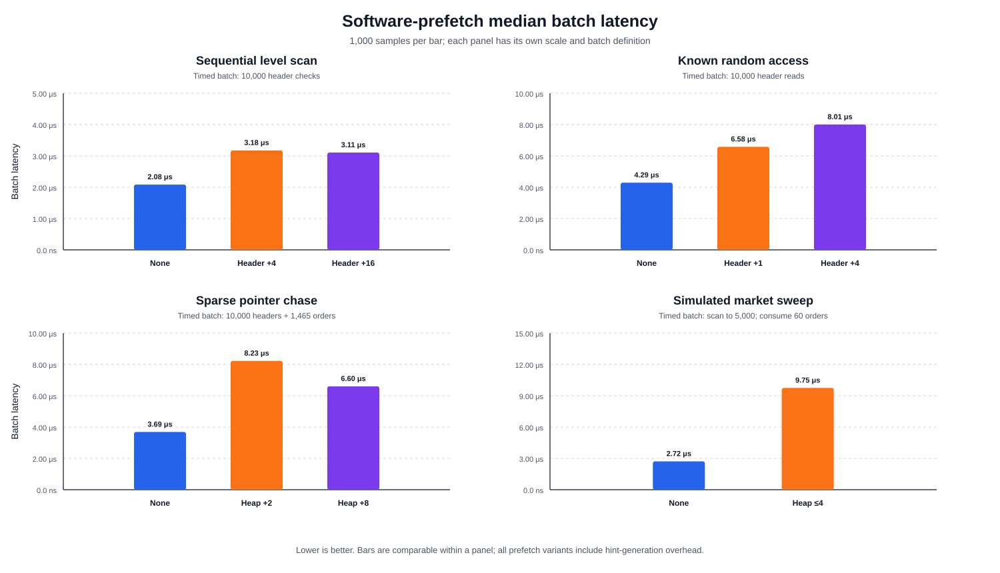
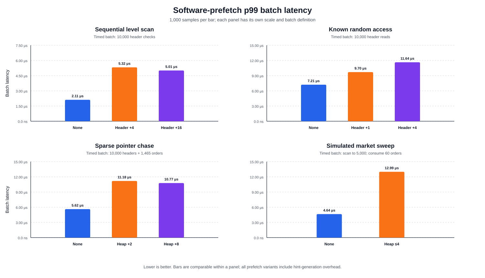

# Software Prefetching Experiment

This experiment uses the global TSC timing procedure defined in [Experimental Methodology](01_methodology.md). Its measurement unit is one complete synthetic memory-access batch, not one production order-book operation.

## 8.2 Software prefetching

### 8.2.1 Definition and purpose

Software prefetching allows a program to provide the processor with an address that it expects to access in the future. The processor may begin bringing the corresponding cache line closer to the executing core while other instructions continue. A useful hint can overlap memory-access latency with computation, but a hint also requires address calculation, conditions, and execution resources. It can be too early, too late, unnecessary for data already resident in cache, or directed at data that is never used.

This experiment evaluates the x86-64 `_mm_prefetch` intrinsic with `_MM_HINT_T0`, a high-temporal-locality hint. The hint is advisory rather than a guaranteed load into a particular cache level. No other hint type is tested.

The synthetic structure resembles the Fixed-Tick representation. It contains 10,000 contiguous `Level` values. Each level is a 24-byte `Vec` header that may point to a separate heap allocation of 24-byte order records. The experiment distinguishes two prefetch targets:

- **Level-header prefetch:** provide the address of a future `Level` inside the contiguous 240,000-byte level array.
- **Heap-data prefetch:** read a future level's `Vec` pointer and provide the address of its separately allocated order data.

Four access patterns are measured, as summarized in Figure 8.4.



*Figure 8.4: Prefetch targets in the sequential, known-random, sparse pointer-chase, and simulated market-sweep batches. The distances describe future loop iterations, not byte offsets.*

The experiment tests complete prefetch strategies rather than the isolated cost of one prefetch instruction. Prefetching variants necessarily execute additional indexing, bounds checks, conditions, and address calculations. A latency difference therefore includes both the hint and the code required to generate it.

### 8.2.2 Experimental procedure

The four timed batches are defined as follows.

1. **Sequential level scan:** The benchmark performs 10,000 contiguous level-header checks and counts non-empty levels. Five hundred orders are placed at deterministically generated random indices before measurement; repeated indices can place more than one order at a level. The variants use no software hint, prefetch the header four iterations ahead, or prefetch the header sixteen iterations ahead.
2. **Known random access:** Every one of the 10,000 levels contains one order, and a deterministic array of 10,000 random indices is generated before measurement. The timed loop reads the `Vec` length at each indexed level; it does not dereference the order-data pointer. The variants use no hint or prefetch the future header one or four index-array positions ahead.
3. **Sparse pointer chase:** Five hundred deterministic population attempts create 486 non-empty levels containing 1,465 orders. Every sample scans all 10,000 headers and sums the quantities in the heap allocations. The prefetching variants target the heap data of a non-empty level two or eight array positions ahead.
4. **Simulated market sweep:** A new synthetic book is constructed before every timed sample. It has three 100-unit orders at each of 20 consecutive levels from index 5,000 through 5,019, plus 50 random noise-level insertions above index 5,100. The market-order simulation scans from index zero and consumes all 60 orders in the consecutive block. Its prefetching variant checks up to four future headers on every loop iteration and hints the heap data of the first non-empty level found in that window.

All test data, random indices, and per-sample market books are constructed outside the TSC interval. The sequential, random, and pointer-chase variants time their complete traversal and accumulation. The market-sweep interval includes scanning, fill-vector construction, order removal, hash-index removal, and destruction of the returned fill vector. It excludes construction of the initial synthetic book.

Every operation/variant pair contains 1,000 timed samples. There is no explicit cache-flush or warm-up phase. The sequential, random, and pointer-chase inputs are reused for every sample, and all variants execute in a fixed order beginning with the no-prefetch baseline. The data can therefore already be cache-resident during much of the experiment. This design evaluates the hints under repeated in-process use; it is not a forced cache-miss benchmark.

The baseline and prefetch loops are not instruction-for-instruction identical. The baseline sequential and pointer-chase cases use iterator traversal, while prefetch variants use indices to address future elements. The observed difference consequently measures the implemented strategy as a whole and cannot be assigned solely to `_mm_prefetch`.

The experiment records no hardware performance counters. Cache hits, cache misses, prefetch usefulness, bandwidth, and instruction counts are not observed directly. Furthermore, `_mm_prefetch` behavior is microarchitecture-specific, making the result specific to the tested x86-64 processor and benchmark conditions.

### 8.2.3 Results

Table 8.2 reports median and p99 batch latency from the regenerated `results/bench_prefetch.csv`. The calibrated TSC frequency for this run was 4.192 GHz.

| Timed batch | Variant | p50 | p99 | p50 change from no prefetch |
|---|---|---:|---:|---:|
| Sequential scan | No prefetch | 8,736 (2,084.0 ns) | 8,862 (2,114.0 ns) | baseline |
|  | Header +4 | 13,314 (3,176.0 ns) | 22,302 (5,320.1 ns) | +52.4% |
|  | Header +16 | 13,020 (3,105.9 ns) | 21,000 (5,009.5 ns) | +49.0% |
| Known random access | No prefetch | 17,976 (4,288.1 ns) | 30,240 (7,213.7 ns) | baseline |
|  | Header +1 | 27,594 (6,582.5 ns) | 40,656 (9,698.4 ns) | +53.5% |
|  | Header +4 | 33,558 (8,005.2 ns) | 48,804 (11,642.1 ns) | +86.7% |
| Sparse pointer chase | No prefetch | 15,456 (3,687.0 ns) | 23,562 (5,620.7 ns) | baseline |
|  | Heap +2 | 34,482 (8,225.6 ns) | 46,872 (11,181.2 ns) | +123.1% |
|  | Heap +8 | 27,678 (6,602.5 ns) | 45,150 (10,770.4 ns) | +79.1% |
| Simulated market sweep | No prefetch | 11,382 (2,715.1 ns) | 19,446 (4,638.8 ns) | baseline |
|  | Heap look-ahead ≤4 | 40,866 (9,748.5 ns) | 54,474 (12,994.6 ns) | +259.0% |

*Table 8.2: Batch latency in TSC ticks, with derived nanoseconds in parentheses; 1,000 observations for each operation and variant. Positive changes indicate slower execution.*



*Figure 8.5: Median batch latency for each prefetch strategy. Lower is better, and every panel has an independent scale.*

Neither sequential prefetch distance improves the baseline. Prefetching four headers ahead increases median latency by 52.4%, while sixteen ahead increases it by 49.0%. The level-header array is contiguous and repeatedly scanned, so hardware prefetching and cache residency may already serve the access pattern. The software-hint loops also perform an additional bounds test, future-index calculation, and hint instruction on almost every iteration. The data do not identify how much each factor contributes.

Known random indices provide future addresses that the hardware cannot infer from a simple stride, but the tested hints remain slower. Prefetching one index-array position ahead increases the median by 53.5%; prefetching four ahead increases it by 86.7%. The timed operation reads only the 24-byte level header, and the complete header array occupies approximately 234.4 KiB. Repeated batches do not force those headers out of cache, so there may be little latency left for the hint to hide. A distance of one also provides very little intervening work, while the distance-four strategy still pays one hint per access.

The heap-targeted pointer-chase variants are also slower. The +2 strategy more than doubles the median, while +8 increases it by 79.1%. Only 486 of the 10,000 scanned levels are non-empty. Each future `is_empty` test is extra work, and a heap prefetch is issued only when the exact future offset contains data. The hints therefore add checks across the entire scan but target heap allocations relatively infrequently.

The largest regression occurs in the simulated market sweep: median latency rises from 2,715.1 ns to 9,748.5 ns, a factor of 3.59. Before reaching index 5,000, the prefetching loop commonly checks four future headers for every current empty level and finds nothing to prefetch. This repeated look-ahead dominates a workload whose baseline is primarily a long empty-level scan followed by only 20 populated levels. The result criticizes this particular search-and-prefetch strategy, not the general idea of prefetching a next known non-empty level.



*Figure 8.6: p99 batch latency for the same variants. Every tested hint also increases tail latency.*

The p99 results preserve the median ordering. Relative to the corresponding baseline, sequential +4 and +16 are 151.7% and 137.0% slower; random +1 and +4 are 34.4% and 61.4% slower; pointer +2 and +8 are 98.9% and 91.6% slower; and the market look-ahead strategy is 180.1% slower.

Only 1,000 samples are available for each point, without confidence intervals or independent repeat runs. The tail comparisons should therefore be treated as descriptive observations. Nevertheless, the size of every median regression is larger than a timestamp-quantization difference, and no tested variant provides even a median improvement.

Overall, manual T0 prefetching is not beneficial for these four implementations on the tested processor. The most important engineering result is that calculating a future address and deciding whether to prefetch it can cost more than the memory latency being targeted, especially when data are repeatedly reused or useful targets are sparse. A future experiment should first record cache-miss and prefetch-related hardware counters, then test a traversal that already knows the next non-empty level without scanning extra headers solely to discover a prefetch target.

## Reproducing the prefetch results and figures

Regenerate the CSV and all three SVG figures from the repository root:

```bash
cargo run --release -- bench_prefetch
python3 scripts/generate_thesis_plots.py --scenario prefetch
```

A smaller development run can be requested without changing the source:

```bash
ORDERBOOK_PREFETCH_SAMPLES=100 \
  cargo run --release -- bench_prefetch
```

A reduced run overwrites `results/bench_prefetch.csv` and must not be used as the final thesis dataset unless its lower sample count is stated explicitly.
