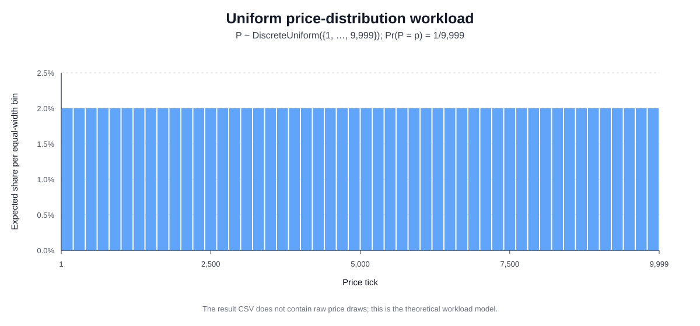
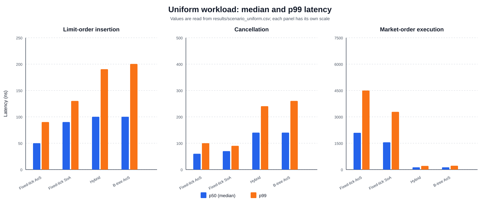
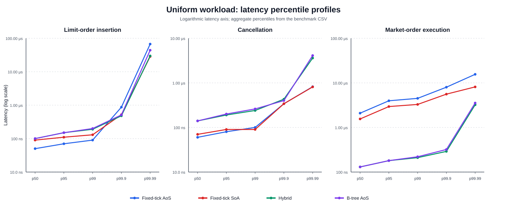

# Experimental Methodology and Uniform-Distribution Workload

This draft is written to follow the implementation chapter. Section numbering can be adjusted to match the final thesis structure.

## 5. Experimental Methodology

### 5.1 Experimental objective

The experiments evaluate how the internal representation of a limit order book affects the latency of three operations: inserting a limit order, cancelling a resting order, and executing a market order. Four implementations are compared: a fixed-tick Array-of-Structs (AoS) book, a fixed-tick Structure-of-Arrays (SoA) book, a hybrid hot/cold book, and a tree-based AoS book. Each implementation conforms to the same `OrderbookTrait` interface and is supplied to the benchmark as a generic type. Rust therefore resolves the implementation at compile time, avoiding virtual-dispatch overhead in the measured path.

The independent variables are the order-book implementation and the workload scenario. The dependent variable is operation latency, measured in timestamp-counter ticks and summarized using the minimum, arithmetic mean, maximum, and the p50, p95, p99, p99.9, and p99.99 percentiles. Throughput and hardware performance counters are not measured by the current distribution scenarios and should not be presented as measured outcomes of these experiments.

### 5.2 Controlled benchmark inputs

All implementations receive the same deterministic event sequences. The pseudo-random generator is `StdRng`, initialized from a fixed seed of 42. Subsequent batches use the batch number as a deterministic seed offset. This makes a workload repeatable and ensures that implementation comparisons within one benchmark run use identical prices and cancellation orders.

Unless a scenario specifies otherwise, prices are represented as integer ticks in the valid half-open interval \([1,10000)\), and every order has a quantity of 100 units. Bid and ask orders alternate during the insertion phase, producing equal side counts in every complete batch. Fixing quantity and side balance reduces unrelated variation and isolates the effects of the price distribution and data structure.

### 5.3 Benchmark phases

Each distribution scenario measures the three operations separately.

**Insertion and cancellation.** A new book is created and populated with 10,000 limit orders. Each call to `add_order` is timed individually. The identifiers of the inserted orders are then shuffled, after which the same orders are cancelled in random order and each `cancel_order` call is timed. The book is therefore returned to an empty state. This build-and-empty procedure is repeated until 1,000,000 insertion observations and 1,000,000 cancellation observations have been collected for each implementation.

**Market-order execution.** A separate book is pre-populated with 200 ask orders. This initialization is outside the timed region. The benchmark then measures 100 buy market orders, each for 100 units. Because every resting ask also contains 100 units, each measured market order consumes exactly one complete resting order and partial fills are avoided. A new book is created after every 100 measurements, and the process continues until 1,000,000 market-order observations have been collected per implementation.

This procedure controls book density across repeated batches. It does not, however, hold the book state perfectly constant within a batch: the insertion phase grows the book, the cancellation phase shrinks it, and successive market orders consume the lowest remaining asks. The reported latency distributions therefore characterize the complete scenario rather than one fixed book state.

### 5.4 Latency measurement

The timing method described in this section is global to the experimental study. All reported per-operation latency measurements—including the baseline, price-distribution scenarios, operational scenarios, and isolated optimization experiments—use the same `LatencyTracker` and therefore the same timestamp-reading and aggregation procedure. Later scenario sections define only the workload, controlled parameters, and measured operation; they do not redefine the clock or latency calculation. The wall-clock `Instant` measurements in the command-line runner are used only to report the total duration of a benchmark suite and are not used for the per-operation comparisons.

#### 5.4.1 The processor time-stamp counter

Operation latency is measured using the x86-64 time-stamp counter (TSC). The TSC is a 64-bit processor register that increases monotonically, and the `RDTSC` instruction copies its current value into general-purpose registers. Reading this counter is substantially cheaper than making an operating-system timing call, which makes it suitable for measuring operations whose latency is on the order of tens or hundreds of nanoseconds.

The recorded values are described as **TSC ticks** in this thesis and in the result CSV columns (`min_tsc`, `p50_tsc`, and so forth). They are not GPU cycles, retired instruction counts, or necessarily cycles at the processor core's instantaneous turbo frequency. On processors that provide an invariant TSC, the counter advances at a constant reference rate independently of changes between processor power and frequency states. The invariant TSC therefore provides a stable time base, but one TSC tick must not automatically be equated with one current-frequency core cycle [1].

#### 5.4.2 Ordering the measurement boundaries

Modern processors execute instructions out of order. A plain `RDTSC` instruction is not serializing, so earlier instructions may still be executing when the start timestamp is read, or instructions belonging to the measured operation may begin before that read has completed. Either effect can move work across the intended measurement boundary and distort a very short latency measurement [2].

The implementation reduces this problem by using separate start and end sequences:

```text
LFENCE
start = RDTSC
LFENCE

measured operation

end = RDTSCP
LFENCE
latency = end - start
```

At the start boundary, the first `LFENCE` prevents earlier instructions and loads from overlapping the measurement. `RDTSC` then reads the TSC, and the second `LFENCE` prevents the measured operation from beginning before the timestamp read has completed. At the end boundary, `RDTSCP` waits until earlier instructions have executed and earlier loads are globally visible before reading the counter. The final `LFENCE` prevents later instructions from being executed ahead of the timestamp read. This sequence follows the ordering guidance in Intel's instruction-set reference [2, 3].

`RDTSCP` does not guarantee that all previous stores have become globally visible. An `MFENCE` would also be required if global visibility of every store were part of the latency definition [3]. The present experiment instead measures completion according to the ordering guarantees of `RDTSCP`, which is appropriate for comparing the local execution path of the four implementations.

#### 5.4.3 Measurement boundary in the benchmark harness

The `LatencyTracker::record` method reads the starting timestamp immediately before invoking the supplied operation and reads the ending timestamp immediately after that operation returns. For sample \(j\), the recorded latency is therefore

\[
L_j = T_{j,\mathrm{end}} - T_{j,\mathrm{start}}.
\]

Appending \(L_j\) to the sample vector occurs after the end timestamp and is not included in the measured interval. Scenario setup, such as creating a new order book and inserting the 200 asks used to initialize the market-order workload, is also outside the timed interval. Work performed inside an order-book method—including validation, data-structure traversal, allocation, matching, and creation of fill records—is included. In the present market-order benchmark, the returned fill vector is discarded inside the measured closure, so its destruction is included as well.

The timing instructions and fences have their own non-zero cost. Because the implementation does not measure and subtract an empty timing interval, every observation includes this fixed measurement overhead. Applying the same harness to every implementation makes relative comparisons meaningful, but the shortest absolute latency values are slightly inflated by the timer itself.

#### 5.4.4 Conversion from TSC ticks to nanoseconds

The benchmark records TSC ticks directly and calibrates their rate against Rust's monotonic `Instant` clock. For each calibration sample, it reads both clocks, waits for a 50 ms interval, reads them again, and calculates

\[
f_{\mathrm{TSC},k}
=
\frac{T_{k,\mathrm{end}}-T_{k,\mathrm{start}}}
{W_{k,\mathrm{end}}-W_{k,\mathrm{start}}},
\]

where the numerator is measured in TSC ticks and the denominator is measured in nanoseconds. The result is expressed in ticks per nanosecond, which is numerically equivalent to gigahertz. Five calibration samples are collected and their median is used as the TSC frequency for the benchmark run:

\[
f_{\mathrm{TSC,GHz}}
=
\operatorname{median}\left(f_{\mathrm{TSC},1},\ldots,f_{\mathrm{TSC},5}\right).
\]

Using the median reduces the influence of a scheduling interruption or timing disturbance during one calibration interval. Once the TSC frequency has been established, a measured latency is converted using

\[
L_{\mathrm{ns}} = \frac{L_{\mathrm{TSC}}}{f_{\mathrm{TSC,GHz}}}.
\]

For example, if the calibrated rate is 3.000 TSC ticks per nanosecond, a measurement of 210 ticks corresponds to

\[
L_{\mathrm{ns}} = \frac{210}{3.000} = 70.0\ \mathrm{ns}.
\]

This approach measures the rate of the same counter used to time the operations. It does not use the instantaneous `cpu MHz` value reported by `/proc/cpuinfo`, so dynamic changes in the processor core's operating frequency do not distort the conversion. The calibrated TSC frequency is stored in the `tsc_ghz` column of every result CSV. TSC ticks remain the directly measured unit, while nanoseconds are derived from the calibrated relationship between the TSC and the monotonic clock.

On non-x86-64 systems, the implementation does not use `RDTSC`; it falls back to Rust's monotonic `Instant` clock and stores elapsed nanoseconds. For this fallback, the conversion factor is one tick per nanosecond. Results from the fallback path should not be mixed directly with x86-64 TSC results without explicitly identifying the different timing method.

#### 5.4.5 Statistical aggregation

One latency value is retained for every measured operation. After all observations have been collected, the sample vector is sorted. For percentile \(q\), the implementation selects the observation at index

\[
i_q = \left\lfloor q(n-1) \right\rfloor,
\]

where \(n\) is the number of samples. This procedure is used for the p50, p95, p99, p99.9, and p99.99 values. The minimum, maximum, and arithmetic mean are also calculated. One CSV row is written for each combination of scenario, implementation, and operation, containing the directly measured TSC statistics, the calibrated TSC frequency, and the corresponding derived nanosecond values.

Percentiles are emphasized because matching-engine latency distributions are typically asymmetric and can contain rare but very large observations caused by allocation, cache misses, interrupts, pre-emption, or operating-system activity. The median describes the typical operation, while p99 and the higher percentiles describe tail latency. A maximum is reported for completeness but should not be interpreted as a stable performance guarantee.

#### 5.4.6 Measurement limitations

The current harness does not pin the benchmark thread to one logical processor. Although `RDTSCP` also returns the `TSC_AUX` value that can be used to identify processor migration, the code discards this value. Interrupts, task pre-emption, migration, dynamic frequency behavior, and background processes can therefore contribute to the observed tail. These effects should be reduced by controlling the execution environment and quantified by repeating the complete experiment, rather than by deleting large observations after measurement.

[1]: https://www.intel.com/content/dam/www/public/us/en/documents/manuals/64-ia-32-architectures-software-developer-vol-3b-part-2-manual.pdf "Intel 64 and IA-32 Architectures Software Developer's Manual, Volume 3B: Time-Stamp Counter"
[2]: https://cdrdv2-public.intel.com/671110/325383-sdm-vol-2abcd.pdf "Intel 64 and IA-32 Architectures Software Developer's Manual, Volume 2: RDTSC"
[3]: https://cdrdv2-public.intel.com/782151/253667-sdm-vol-2b.pdf "Intel 64 and IA-32 Architectures Software Developer's Manual, Volume 2B: RDTSCP"

### 5.5 Execution protocol and reproducibility

The scenarios are compiled and executed with Rust's optimized release profile. Running a named scenario through the benchmark runner builds the release examples, executes the selected binary, and overwrites its corresponding CSV in the `results/` directory. For example, the uniform scenario is generated with:

```bash
cargo run --release -- scenario_uniform
```

All four price-distribution scenarios can be regenerated together with:

```bash
cargo run --release -- \
  scenario_uniform \
  scenario_clustered \
  scenario_zipfian \
  scenario_bursty
```

The complete set of CSV-producing benchmarks is regenerated with:

```bash
cargo run --release -- \
  bench_latency \
  scenario_uniform \
  scenario_clustered \
  scenario_zipfian \
  scenario_bursty \
  scenario_high_cancel \
  scenario_sweep \
  scenario_buildup \
  scenario_steady_state
```

Each benchmark performs a new TSC calibration before collecting operation latencies. The resulting CSV contains the calibration in `tsc_ghz`, direct measurements in the `*_tsc` columns, and converted values in the `*_ns` columns. Old CSV files created by the previous `/proc/cpuinfo` conversion must not be combined with the recalibrated results.

For the final reported experiment, the following environment information should also be recorded: processor model, operating system and kernel, Rust compiler version, power/performance governor, CPU affinity, and whether background services were minimized. The current benchmark does not pin its process to one logical CPU, perform an explicit warm-up phase, subtract timer overhead, or randomize implementation order. These factors should either be controlled in the final run or acknowledged as threats to validity. Repeating the complete benchmark several times would additionally allow run-to-run variability and confidence intervals to be reported; a single one-million-sample run estimates within-run percentiles but not between-run uncertainty.

## 6. Price-Distribution Workloads

Price distribution determines both the logical state of an order book and the physical memory-access pattern produced by an operation. A narrow distribution repeatedly accesses a small set of price levels and tends to preserve locality. A wide distribution spreads activity across more levels and is more likely to expose the cost of array scanning, tree traversal, allocation, and sparse memory access. The distribution scenarios therefore use identical order-book operations while varying how prices are selected.

### 6.1 Uniform random distribution

#### 6.1.1 Definition and purpose

In the uniform scenario, every valid integer price tick has the same probability of being selected. If \(P\) denotes the generated price, then

\[
P \sim \operatorname{DiscreteUniform}\{1,2,\ldots,9999\},
\qquad
\Pr(P=p)=\frac{1}{9999}.
\]

The expected price is 5,000 ticks. The distribution is intentionally spread across the complete supported price range rather than concentrated around a mid-price. It should therefore be interpreted as a synthetic low-locality stress workload, not as a realistic model of ordinary order placement. Its purpose is to expose how the four data structures behave when successive events frequently refer to distant price levels.

Figure 6.1 illustrates the theoretical workload. The plotted bins have equal width and therefore equal expected mass. It is a model of the generator rather than a histogram of benchmark observations, because the result CSV stores aggregate latency percentiles and does not store the generated prices.



*Figure 6.1: The discrete uniform price model used by the benchmark. Each price in the interval from 1 through 9,999 is equally likely.*

#### 6.1.2 Scenario procedure

For insertion and cancellation, each independent book receives 10,000 orders whose prices are sampled from the uniform distribution. Sides alternate between bid and ask, and all quantities are fixed at 100 units. Once the book is full, its order identifiers are shuffled and every order is cancelled. One hundred such batches produce 1,000,000 timed insertions and 1,000,000 timed cancellations for each implementation.

For market-order execution, a fresh book is initialized with 200 uniformly distributed asks. The benchmark then measures 100 buy market orders of 100 units before replacing the book. This sequence is repeated 10,000 times, yielding 1,000,000 observations for each implementation. The workload favors neither a particular price region nor the hybrid book's 200-level hot zone, which is initially centred at tick 5,000.

The use of a wide price range is expected to reduce spatial and temporal locality, particularly for the two fixed-grid representations. Nevertheless, the benchmark records latency rather than hardware cache or TLB events. Cache- and TLB-related explanations of the results must therefore be presented as architectural interpretations, not as directly measured causal claims.

#### 6.1.3 Results

Table 6.1 reports median and p99 latency. TSC tick counts are the measured values; nanoseconds are derived using the calibrated TSC frequency recorded in the CSV. The table and the result figures below are preliminary and must be refreshed after regenerating `results/scenario_uniform.csv` with the calibrated timing code.

| Operation | Metric | Fixed-tick AoS | Fixed-tick SoA | Hybrid | B-tree AoS |
|---|---:|---:|---:|---:|---:|
| Insertion | p50 | 210 (52.1 ns) | 378 (93.8 ns) | 420 (104.2 ns) | 420 (104.2 ns) |
|  | p99 | 336 (83.4 ns) | 756 (187.6 ns) | 798 (198.1 ns) | 798 (198.1 ns) |
| Cancellation | p50 | 252 (62.5 ns) | 294 (73.0 ns) | 588 (145.9 ns) | 588 (145.9 ns) |
|  | p99 | 336 (83.4 ns) | 420 (104.2 ns) | 1,008 (250.2 ns) | 1,008 (250.2 ns) |
| Market order | p50 | 5,586 (1,386.4 ns) | 6,888 (1,709.6 ns) | 546 (135.5 ns) | 546 (135.5 ns) |
|  | p99 | 11,718 (2,908.4 ns) | 15,456 (3,836.1 ns) | 840 (208.5 ns) | 882 (218.9 ns) |

*Table 6.1: Preliminary uniform-workload latency in TSC ticks, with derived nanoseconds in parentheses; 1,000,000 observations per implementation and operation. Values must be refreshed from the recalibrated CSV before final submission.*



*Figure 6.2: Median and p99 operation latency under uniformly distributed prices. Each operation uses a separate vertical scale.*

The fixed-tick AoS implementation has the lowest insertion latency: its median of 210 ticks is 44.4% lower than the SoA median of 378 ticks and 50.0% lower than the hybrid and tree medians of 420 ticks. This result is consistent with the fixed-grid insertion path, which maps a price directly to an array index and appends one complete `Order` value. The SoA variant performs several vector appends for the separate fields, while the hybrid and tree designs usually perform a tree operation for uniformly distributed prices.

The fixed-tick AoS implementation also records the lowest cancellation latency, followed closely by SoA. With 10,000 orders distributed over 9,999 ticks and split evenly between the two sides, most occupied side/price levels contain only one order. The scenario therefore does not strongly exercise the proposed SoA advantage of scanning a densely packed identifier array at a deep price level. Instead, the additional parallel-array maintenance remains visible, while the local search within a level is usually short.

Market-order execution reverses the ranking. The hybrid and tree implementations both record a median of 546 ticks, compared with 5,586 ticks for fixed-tick AoS and 6,888 ticks for SoA. The fixed-tick AoS median is consequently 10.23 times the hybrid median, and its p99 is 13.95 times the hybrid p99. The main structural explanation is best-price discovery. Under a sparse uniform book, the fixed-grid variants scan many empty price levels to locate the lowest ask, whereas the tree can access its lowest key and the hybrid can compare the best hot-zone and cold-zone candidates. This result demonstrates that direct indexing is beneficial for insertion but does not guarantee fast ordered traversal in a sparse price space.

The complete percentile profiles in Figure 6.3 show that the same ranking persists into the measured tail. Maximum values are intentionally omitted from this plot because isolated interruptions and scheduling events can dominate a single maximum; p99.9 and p99.99 provide more stable descriptions of tail behavior.



*Figure 6.3: Latency percentile profiles for the uniform scenario. The vertical axis is logarithmic and each operation is displayed separately.*

Overall, no implementation dominates every operation. Fixed-tick AoS is best for uniform insertion and cancellation, while the hybrid and tree designs are substantially better for market orders in a sparse, widely distributed book. This is the central result of the uniform scenario: the performance effect of a data layout depends on the access pattern induced by the operation, and contiguous storage alone does not remove the cost of discovering the next occupied level.

## Generating and inserting the figures

The figures above are reproducible from the repository root and require only Python's standard library:

```bash
python3 scripts/generate_thesis_plots.py
```

This creates three SVG files in `figures/`. SVG is preferable for a thesis because text and lines remain sharp when resized. In Microsoft Word, use **Insert → Pictures → This Device** and select the SVG. In LaTeX, either convert the SVG to PDF or use the `svg` package:

```latex
\usepackage{svg}
% ...
\includesvg[width=\linewidth]{figures/uniform_latency_p50_p99}
```

The CSV cannot produce a latency histogram, violin plot, or empirical cumulative-distribution function because raw per-operation samples are discarded after percentile calculation. Producing those figures would require changing `LatencyTracker` to export its sample vector or to write a histogram during the benchmark.
